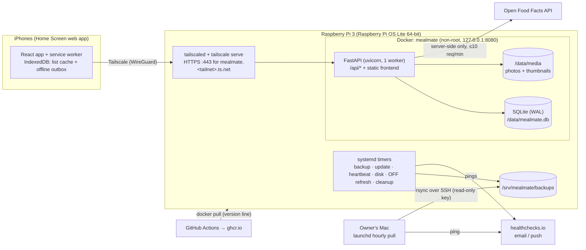

# MealMate v2 — Implementation plan

| | |
|---|---|
| Status | Agreed baseline, 2026-09-26 |
| Requirements | [`requirements.md`](requirements.md) (IDs such as `LIST-04` refer to it) |

This document describes the architecture, the data model, how the code is organised, tested, released and operated, and the milestones in which v2.0 is built.

---

## 1. Principles

1. **Risk first.** The iPhone-specific parts are tested on a real iPhone over Tailscale early (milestone M1), before features are built on top: HTTPS, Home Screen app, offline, camera and share sheet.
2. **Backend owns the logic.** Amounts, conversions, aggregation, rounding, nutrition and permissions live in Python and are tested there. The frontend displays and formats (AGG-01, MNT-02).
3. **One contract between frontend and backend.** The contract is the OpenAPI description, and TypeScript types are generated from it (MNT-01).
4. **Small, boring runtime.** The Pi runs one container (Python app plus the built frontend) and a few systemd timers. There are no extra services.
5. **Everything scripted and tested.** This covers setting up a Pi, backup, restore, update and rollback. Nothing depends on remembering manual steps.
6. **Public repo, no secrets.** No secrets are committed, and defaults are safe.

## 2. Architecture



**Request path:** iPhone → Tailscale tunnel → `tailscale serve` (TLS) → `127.0.0.1:8080` → FastAPI.
- FastAPI serves `/api/*`.
- For every other path it serves the built frontend (`index.html` as the fallback for client-side routes).
- It sends strong cache headers for hashed assets and no-cache for `index.html` and the service worker.

**Why one container:**
- The frontend is a static build, so a separate web server on the Pi would only cost RAM.
- TLS is handled by Tailscale.
- The separation between frontend and backend is kept at code level (separate projects and toolchains, API-only communication), not at runtime.
- In development the frontend runs on the Vite dev server and proxies `/api`.

## 3. Repository layout

```
MealMate/
├── backend/
│   ├── pyproject.toml, uv.lock
│   ├── alembic.ini, alembic/versions/
│   ├── app/
│   │   ├── main.py            # app factory, middleware, static frontend
│   │   ├── core/              # config, security (JWT, hashing), errors (ErrorCode enum,
│   │   │                      # envelope, handlers), rate limiting, logging, headers
│   │   ├── db/                # engine (SQLite pragmas), session, base, ids (UUIDv7)
│   │   ├── models/            # SQLAlchemy models, one module per aggregate
│   │   ├── schemas/           # Pydantic request/response models (= the API contract)
│   │   ├── repositories/      # queries only, no business rules
│   │   ├── services/          # business rules + permission checks
│   │   ├── domain/            # pure logic, no DB: units, nutrients registry, nutrition,
│   │   │                      # aggregation, rounding, text normalisation
│   │   ├── integrations/      # Open Food Facts client
│   │   ├── media/             # image processing, signed URLs
│   │   ├── api/               # routers (thin: parse → service → schema)
│   │   ├── cli.py             # `mealmate …` commands (Typer)
│   │   └── seeds/             # categories, cuisines
│   └── tests/
│       ├── unit/              # domain/, services with fakes
│       ├── api/               # HTTP-level tests against a temp SQLite DB
│       └── migrations/        # upgrade/downgrade chain, no pending autogenerate diff
├── frontend/
│   ├── package.json, vite.config.ts, tsconfig*.json, eslint/prettier config
│   ├── index.html, public/ (icons, manifest assets)
│   └── src/
│       ├── api/               # generated/schema.ts (generated), client.ts, errors.ts
│       ├── app/               # router, providers, layout, bottom tab bar
│       ├── features/          # auth, lists, shopping, meals, ingredients, scanner,
│       │                      # me, admin, couple, sync
│       ├── components/ui/     # shadcn/ui components (copied source)
│       ├── components/        # shared app components
│       ├── i18n/              # de.json, en.json, index.ts, format.ts
│       ├── lib/               # small helpers
│       ├── sw/                # service worker (Workbox, injectManifest)
│       └── styles/            # Tailwind entry + design tokens (light/dark)
├── e2e/                       # pytest-playwright suite (Python)
├── deploy/
│   ├── compose.yml            # production compose for the Pi
│   ├── pi/                    # setup.sh, restore.sh, backup.sh, update.sh, heartbeat.sh,
│   │                          # disk-check.sh, systemd/*.service|*.timer, env.example
│   └── mac/                   # install-backup-pull.sh, pull.sh, launchd plist template
├── compose.dev.yml            # dev: backend (reload) + Vite dev server
├── Dockerfile                 # multi-stage production image
├── docs/                      # requirements, plan, operations runbook, user guides
├── .github/                   # workflows, dependabot.yml, PR template
├── LICENSE (AGPL-3.0), README.md, CONTRIBUTING.md, SECURITY.md
```

## 4. Tech stack

| Area | Choice | Notes |
|---|---|---|
| Runtime | Python **3.13** | Verify arm64 wheels in M0 and pick the newest version with full wheel coverage (O-8) |
| Web | FastAPI, uvicorn (1 worker) | Single process, as needed for SQLite and in-memory rate limiting |
| DB | SQLite (WAL), SQLAlchemy 2 (async, aiosqlite), Alembic (`render_as_batch`) | Pragmas: `foreign_keys=ON`, `journal_mode=WAL`, `synchronous=NORMAL`, `busy_timeout=5000` |
| Validation / config | Pydantic v2, pydantic-settings (`MEALMATE_` prefix) | |
| Auth | PyJWT (access), opaque refresh tokens, bcrypt | |
| HTTP client | httpx | OFF client; mocked with respx in tests |
| Images | Pillow | Re-encode, strip metadata, 1600 px + 400 px thumbnail |
| CLI | Typer | `mealmate …` inside the container |
| Tooling | uv, ruff, mypy, pytest, pytest-asyncio, Hypothesis, coverage | |
| Frontend | React 19, TypeScript, Vite, react-router | |
| UI | Tailwind CSS v4, shadcn/ui (Radix), lucide-react | Design tokens in CSS variables; light and dark |
| Server state | TanStack Query | |
| API client | openapi-typescript + openapi-fetch | Types generated from `openapi.json` |
| i18n | i18next + react-i18next, `Intl` for formats | |
| PWA / offline | vite-plugin-pwa (Workbox, injectManifest), idb (IndexedDB) | |
| Barcode | zxing-wasm (lazy-loaded) | EAN-13/8, UPC-A/E; typed-in barcode as fallback |
| Frontend tests | Vitest, Testing Library, eslint, prettier, `tsc` | |
| E2E | pytest-playwright (Chromium + WebKit, iPhone device profiles), axe-core | |
| Node | 24 LTS | |
| CI/CD | GitHub Actions, ghcr.io, native arm64 runners (`ubuntu-24.04-arm`) | |

## 5. Backend design

### 5.1 Layers

`api/` (HTTP only) → `services/` (rules, permissions, transactions) → `repositories/` (queries) → `models/`.
- `domain/` is pure Python without I/O and holds all calculations, so it can be tested exhaustively.
- Routers never touch the ORM directly.
- Every endpoint declares a `response_model` and a stable `operation_id`, both needed for type generation.

### 5.2 IDs, time and text normalisation

- **Primary keys:** UUIDv7 strings for all entities. Being sortable helps; being client-generatable is needed for offline extra items (SYNC-03).
- **Timestamps:** UTC in the database.
- **`*_norm` columns:** lowercase, `ä→ae ö→oe ü→ue ß→ss`, accents stripped, whitespace collapsed. They are used for uniqueness and search (ING-03, REF-04, ACC-05).

### 5.3 Errors (I18N-03)

- **Envelope:**

  ```json
  {"code": "meal.not_found", "params": {}, "fields": [{"loc": ["body","name"], "code": "required"}]}
  ```

- Custom handlers make `HTTPException`, `RequestValidationError` (422), rate-limit (429) and unexpected (500) responses all use this envelope.
- `ErrorCode` is one `StrEnum`, exported in OpenAPI.
- A frontend test checks that every code has `de` and `en` translations.

### 5.4 Authentication and sessions (ACC, SEC-03)

- **Login:** `POST /api/auth/login` returns `{access_token, expires_in, user}` and sets the refresh cookie `mm_refresh`: `HttpOnly; Secure; SameSite=Strict; Path=/api/auth`, 90 days.
- **Refresh:** `POST /api/auth/refresh` requires the cookie and the header `X-MealMate-Client: web`, a simple CSRF guard.
  - The refresh token **rotates** on each use.
  - Reusing an old refresh token revokes the whole session ("token family").
- **Access tokens:** JWT with HS256, valid 15 min, containing `sub`, `sid`, `role` and `iat`, and held only in memory.
- **Revocation:** the server checks for every request that the session still exists and is not revoked. This is one indexed lookup, cheap at this scale, and it makes "log out all devices" and deactivation take effect immediately.
- **Passwords:** bcrypt with a cost factor tuned in M2 to about 250–500 ms on the Pi 3 (O-7). There is a length check of ≤ 72 bytes and a common-password list (top 10k, bundled).
- **Invite and reset codes:** 32 random bytes, base64url, stored as SHA-256. A link opens the form; only `POST /api/auth/join` or `/api/auth/reset` consumes the code (ACC-04).
- **Login throttling** (ACC-11): an in-memory sliding window per `username_norm` and per client IP, with an exponential delay after 5 failures (cap 60 s) and no lockout. The client IP comes from `X-Forwarded-For`, trusted only when the peer is `127.0.0.1` (O-3).

### 5.5 Authorization (SEC-04)

All permission checks live in one module, `services/access.py`:

| Object | View | Edit |
|---|---|---|
| Meal | owner · partner · everyone if owner.meals_public | owner only |
| List | owner · partner if `shared_with_partner` · everyone (read-only) if owner.lists_public | owner · partner if shared (not delete/share switch) |
| Ingredient / product | everyone | everyone; delete/merge: admin |
| Photo | same as its meal (checked when the signed URL is issued) | owner |
| Admin endpoints | admin | admin (never private meals/lists) |

Each rule has API tests, including negative cases.

### 5.6 Units, nutrition and aggregation (`domain/`)

- **Units:**
  - `Unit` enum with its kind: `g`/`kg` are mass; `ml`/`l`/`tbsp`/`tsp` are volume; `piece` is count.
  - Factors to the base unit of each kind: g, ml, piece.
  - `convert(amount, unit, to_base, ingredient)` uses `piece_weight_g` and `density_g_per_ml`. It returns the value plus an `estimate` flag (spoons of g-based ingredients without density, NUT-05), or "not convertible".
- **Nutrients registry:**
  - `NUTRIENTS = [kcal, protein, carbs, sugar, fat]`, each with its OFF field names (`energy-kcal_100g`, `proteins_100g`, `carbohydrates_100g`, `sugars_100g`, `fat_100g`) and a display unit.
  - Nullable columns on `ingredients` (manual values) and `products` are generated from it, and so are the schema fields.
  - Adding a nutrient: add it to the registry, run `alembic revision --autogenerate`, add translation keys, and add OFF mapping tests (MNT-06).
- **Ingredient nutrition** (NUT-02), per field:
  - the manual value, else the mean over the products that have that field, else `None`.
  - It returns the value, its source (`manual`/`products`/`unknown`) and the product mean as a hint.
- **Meal nutrition** (NUT-03/04):
  - the sum over rows of `convert(amount) / 100 × value`;
  - it collects `missing` entries (ingredient + field or "no amount"/"not convertible") and `estimate` flags;
  - it returns the totals per meal and per serving.
- **Aggregation** (AGG), `aggregate(list_state) -> [Line]`:
  1. **Sources.** In `draft`, each list meal takes its rows from the live meal. In `shopping`/`done`, it uses its frozen `list_meal_ingredients`.
  2. Each row gets factor = `list_servings / meal_servings`, and becomes a part `(ingredient, amount × factor, unit, source)`.
  3. Linked extra items become parts of their ingredient. Free-text extra items become their own lines.
  4. **Grouping.** Parts are grouped by line key: `i:<ingredient_id>` for ingredients, `x:<extra_item_id>` for free text.
  5. **Totals.** If all parts with an amount can be converted to the ingredient's base unit, there is one total. Otherwise there is one segment per unit kind ("500 g + 2 Stk."). Parts without an amount set `has_unspecified`.
  6. **Display rounding** (AGG-04) produces `display: [{value, unit}]`, while the exact `total_base` is kept.
  7. **Check state** is applied from `list_line_states` (§ 5.7). Lines hidden in the draft (LIST-07) are returned with `hidden: true`.
  8. **Sort** by category `sort_order`, then name (normalised). The output is deterministic (AGG-05).
- **Tests:** table-driven tests for every rule, plus Hypothesis properties:
  - merging order doesn't matter;
  - scaling by *k* scales totals by *k*;
  - rounding never shows 0 for a positive amount;
  - pieces never round down.

### 5.7 Check state, freezing and editing while shopping

- **Start shopping** (LIST-11) runs in one transaction:
  1. copy each list meal's current rows into `list_meal_ingredients`;
  2. store `meal_servings_snapshot` and the meal name;
  3. create a `list_line_states` row for every current line key;
  4. set `status=shopping`.
- **A meal added while shopping** is frozen immediately.
- **Checking a line** stores `checked`, `checked_at` (client time), `checked_by` and `checked_total_base` (the line's total at that moment, if it can be converted).
- **"Needs more" (LIST-12)** is computed when the list is read: if a checked line's current total is greater than `checked_total_base`, the line is reported as unchecked with `delta = current − checked_total_base`. Checking it again updates `checked_total_base`. Nothing needs to be rewritten when the partner adds meals.
- **"New" lines** are lines in `shopping` state that have no `list_line_states` row yet.
- Every change to a list increments `shopping_lists.version` (SYNC-08).

### 5.8 Offline operations protocol (SYNC)

- **Endpoint:** `POST /api/lists/{id}/ops`, body `{"ops": [{op_id, type, at, payload}]}`. Ops are processed in order in one transaction.

  | `type` | Payload | Rule |
  |---|---|---|
  | `line.check` | `{line_key, checked}` | Last write wins by `at` (ties: higher `op_id`). `at` is clamped to at most server time + 5 min. |
  | `extra.add` | `{extra_id, text, amount_text?, category_key?}` | `extra_id` is created by the client; a duplicate id means already applied |
  | `extra.update` | `{extra_id, text, amount_text?}` | Ignored if the item was deleted (delete wins) |
  | `extra.delete` | `{extra_id}` | Soft delete (tombstone) |
  | `list.finish` | `{}` | No-op if already `done` |

- **Idempotency:** `processed_ops(op_id)` makes every op idempotent. The response lists `applied | duplicate | rejected(code)` per op, plus the new list detail with its `version`.
- **Rejected ops** (list deleted, access lost) come back with a code. The client shows them once and drops them.
- **The online UI uses the same endpoint** for these actions, so there is one code path to test.
- **Polling:** `GET /api/lists/{id}` returns an `ETag: "v<version>"`, and `If-None-Match` gives `304`.

### 5.9 Open Food Facts integration (BAR)

- **Client:** `integrations/off.py`, using API **v3** with a pinned minor version (O-4) and `fields=` limited to what we store. It sends `User-Agent: MealMate/<version> (https://github.com/Bublemann/MealMate)` (configurable).
- **Rate limit:** a global token bucket of 10 requests/min. Excess lookups wait up to 10 s, then return `off.busy`, and the user can retry or enter the values by hand.
- **Lookup flow:** `GET /api/products/lookup?barcode=`:
  1. validate the check digit;
  2. look in the own database;
  3. if not found, ask OFF;
  4. return a *proposal* (not saved) with name (in the user's language, else the generic name), brand, quantity, `product_quantity` and nutrients.

  Saving happens in `POST /api/products` with `ingredient_id`.
- **Refresh:**
  - `mealmate jobs off-refresh` runs nightly and refreshes products with `fetched_at` older than `MEALMATE_OFF_REFRESH_DAYS`, spread out under the rate limit.
  - Opening or scanning such a product triggers a background refresh.
  - Fields that were not user-edited update silently. User-edited fields with different values are stored in `pending_update` (BAR-06).
  - Apply and Ignore endpoints clear it. Ignore also remembers the ignored OFF `last_modified`, so the same values aren't suggested again.

### 5.10 Media (MEAL-04, SEC-07, VIS-05)

- **Upload:** `PUT /api/meals/{id}/photo`, multipart.
  - The type is checked with Pillow (JPEG/PNG/WebP), with a maximum of 10 MB and 40 megapixels.
  - The image is re-encoded to WebP: 1600 px on the long edge (q≈80) plus a 400 px thumbnail. Re-encoding drops EXIF including GPS.
  - Files are stored as `/data/media/<random-uuid>.webp`.
- **Delivery:** the meal response contains **signed URLs** (`/api/media/<key>?exp=…&sig=…`, HMAC with a key derived from `SECRET_KEY`, 24 h). They work in `` tags without an `Authorization` header, and are only issued after the view check.
- **Copies:** copying a meal duplicates its files.
- **Cleanup:** `mealmate jobs cleanup` removes orphaned files.

### 5.11 CLI (`mealmate`)

| Command | Purpose |
|---|---|
| `create-admin` | Interactive first admin (ACC-12) |
| `reset-link <username>` | Print a reset link (last-admin recovery) |
| `db upgrade` | Snapshot the DB if migrations are pending (keep last 3), then `alembic upgrade head` (OPS-06). Used by the entrypoint |
| `backup-db <path>` | Consistent snapshot via the SQLite backup API plus `PRAGMA integrity_check` (OPS-01) |
| `verify-backup <path>` | Integrity check of a snapshot (monthly test restore, OPS-07) |
| `jobs off-refresh` · `jobs cleanup` | Background jobs, called by systemd timers. Cleanup removes expired codes, ops older than 30 days, orphaned media and expired sessions |
| `export-openapi <path>` | Writes `openapi.json` without starting a server (for type generation) |
| `seed-demo` | Demo users, a couple, ingredients, meals and lists for development (refuses to run if real users exist) |

### 5.12 Configuration (`MEALMATE_` environment variables)

| Variable | Default | Notes |
|---|---|---|
| `SECRET_KEY` | **none (required)** | Used for JWT signing, media URL signing and code hashing (pepper) |
| `DATA_DIR` | `/data` | Holds `mealmate.db`, `media/`, `pre-migrate/`, `status/` |
| `PUBLIC_URL` | none (required in prod) | e.g. `https://mealmate.tail1234.ts.net`, used to build invite/reset links |
| `TRUSTED_PROXIES` | `127.0.0.1` | Only these may set `X-Forwarded-For` |
| `OFF_REFRESH_DAYS` | `30` | |
| `OFF_USER_AGENT_CONTACT` | repo URL | |
| `INVITE_TTL_DAYS` / `RESET_TTL_HOURS` | `7` / `24` | |
| `SESSION_IDLE_DAYS` | `90` | |
| `API_DOCS_ENABLED` | `false` | `true` in dev |
| `LOG_LEVEL` | `INFO` | JSON logs to stdout |

Host-level scripts read `/srv/mealmate/.env` as well: `IMAGE_TAG` (e.g. `2.0`) and `HC_HEARTBEAT_URL`, `HC_BACKUP_URL`, `HC_UPDATE_URL`, `HC_DISK_URL`.

## 6. Data model

All tables have `id` (UUIDv7) plus `created_at`/`updated_at` unless stated otherwise. FK = foreign key; the action is what happens on delete.

| Table | Key columns | Notes |
|---|---|---|
| `users` | `username`, `username_norm` (unique), `display_name`, `display_name_norm` (unique), `password_hash`, `role` (`user`/`admin`), `language` (`de`/`en`), `is_active`, `meals_public`, `lists_public`, `meal_filter_hidden` (JSON list of user ids), `last_seen_at`, `password_changed_at` | |
| `sessions` | `user_id` FK cascade, `family_id`, `token_hash` (unique), `last_used_at`, `expires_at`, `revoked_at`, `user_agent` | Refresh-token rotation |
| `one_time_codes` | `kind` (`invite`/`reset`), `code_hash` (unique), `created_by` FK set null, `target_user_id` FK cascade (reset), `expires_at`, `used_at`, `used_by` FK set null, `revoked_at` | |
| `couples` | `requester_id` FK cascade, `addressee_id` FK cascade, `status` (`pending`/`accepted`), `accepted_at` | The "one couple per user" rule is enforced in the service inside the write transaction |
| `categories` | `key` (unique), `sort_order` | Seeded by migration |
| `cuisines` | `key` (unique, nullable), `name` (nullable), `name_norm` (unique), `created_by` FK set null | Seeded entries have a `key`; user-added ones have a `name` |
| `tags`, `meal_tags` | `name`, `name_norm` (unique) · (`meal_id`, `tag_id`) | |
| `ingredients` | `name`, `name_norm` (unique), `category_id` FK, `base_unit` (`g`/`ml`), `piece_weight_g`, `density_g_per_ml`, nutrient columns (manual, nullable), `created_by`/`updated_by` FK set null | |
| `products` | `barcode` (unique), `ingredient_id` FK restrict, `name`, `brand`, `quantity_text`, `pack_quantity`, `pack_unit`, nutrient columns, `source` (`off`/`manual`), `off_last_modified_at`, `fetched_at`, `user_edited_fields` (JSON), `pending_update` (JSON), `ignored_off_modified_at`, `created_by`/`updated_by` | The pack size is stored for the postponed pack-rounding feature |
| `meals` | `owner_id` FK cascade, `name`, `name_norm`, `instructions`, `source_url`, `servings`, `cuisine_id` FK set null, `photo_key`, `copied_from_meal_id` FK set null | |
| `meal_ingredients` | `meal_id` FK cascade, `position`, `ingredient_id` FK restrict, `amount`, `unit`, `note` | |
| `shopping_lists` | `owner_id` FK cascade, `name` (nullable → translated default), `status`, `shared_with_partner`, `version`, `reminder_seed`, `shopping_started_at`, `finished_at` | |
| `list_meals` | `list_id` FK cascade, `meal_id` FK set null, `servings`, `meal_servings_snapshot`, `meal_name_snapshot`, `meal_owner_name_snapshot`, `added_by` FK set null, `frozen_at` | Unique (`list_id`, `meal_id`) while `meal_id` is not null |
| `list_meal_ingredients` | `list_meal_id` FK cascade, `ingredient_id` FK restrict, `ingredient_name_snapshot`, `amount`, `unit`, `note` | Frozen copy of the meal's ingredients (LIST-11) |
| `list_extra_items` | `list_id` FK cascade, `ingredient_id` FK restrict (nullable), `text`, `amount`, `unit`, `amount_text`, `category_id` FK, `added_by` FK set null, `deleted_at` | `id` may be generated by the client |
| `list_line_states` | PK (`list_id`, `line_key`), `checked`, `checked_at`, `checked_by` FK set null, `checked_total_base`, `hidden` | |
| `processed_ops` | `op_id` PK, `user_id`, `list_id`, `applied_at` | Pruned after 30 days |

**Deletion rules:**
- **Meal deleted** (MEAL-07): in the same transaction, its `list_meals` rows in **draft** lists are removed. Frozen rows keep `meal_id = NULL` and their snapshots.
- **User deleted** (ADM-03):
  - lists they share with a partner are transferred to the partner (`owner_id` changes and `shared_with_partner` becomes false);
  - then the cascade removes their meals, other lists, sessions and codes;
  - media files are removed by the cleanup job.
- **Ingredient merge** (ING-05) repoints `meal_ingredients`, `list_meal_ingredients`, `list_extra_items` and `products`, rewrites `list_line_states.line_key` (`i:A` → `i:B`, merging check states), then deletes A.

## 7. API outline

All endpoints are under `/api`, return JSON, and use the error envelope. The source of truth is the generated OpenAPI description.

| Group | Endpoints |
|---|---|
| System | `GET /health` (DB + disk writable) · `GET /version` (version, commit, source URL) |
| Auth | `POST /auth/login` · `/auth/refresh` · `/auth/logout` · `/auth/logout-all` · `GET /auth/codes/{code}` (check, doesn't consume) · `POST /auth/join` · `POST /auth/reset` |
| Me | `GET/PATCH /me` (display name, language, privacy, meal filter) · `POST /me/password` · `GET /me/sessions` · `DELETE /me/sessions/{id}` |
| Couple | `GET /couple` · `POST /couple/requests` · `POST /couple/requests/{id}/accept\|decline\|cancel` · `DELETE /couple` |
| Users | `GET /users/visible` (for filter chips) |
| Reference | `GET /categories` · `GET /units` · `GET/POST /cuisines` · `GET /tags?q=` |
| Ingredients | `GET /ingredients?q=&category=` · `POST` · `GET/PATCH /ingredients/{id}` · `GET /ingredients/{id}/products` |
| Products | `GET /products/lookup?barcode=` · `POST /products` · `PATCH /products/{id}` · `POST /products/{id}/pending-update/apply\|ignore` |
| Meals | `GET /meals?q=&users=&cuisine=&tag=&sort=` · `POST` · `GET/PATCH/DELETE /meals/{id}` · `POST /meals/{id}/copy` · `PUT/DELETE /meals/{id}/photo` · `GET /media/{key}` |
| Lists | `GET /lists?scope=mine\|others&status=` · `POST /lists` · `GET/PATCH/DELETE /lists/{id}` · `POST /lists/{id}/meals` · `PATCH/DELETE /lists/{id}/meals/{list_meal_id}` · `POST /lists/{id}/extra-items` · `PATCH/DELETE …/extra-items/{id}` · `POST /lists/{id}/lines/{key}/hide\|unhide` · `POST /lists/{id}/start-shopping\|reopen\|shop-again\|copy` · `POST /lists/{id}/ops` · `GET /lists/history` · `GET /lists/sync` (all editable draft/shopping lists for the offline copy) |
| Admin | `GET/PATCH /admin/users[/{id}]` (role, active) · `DELETE /admin/users/{id}` · `GET/POST /admin/invites` · `DELETE /admin/invites/{id}` · `POST /admin/users/{id}/reset-link` · `PUT /admin/categories/order` · `POST /admin/ingredients/{id}/merge` · `DELETE /admin/ingredients/{id}` · `GET /admin/system` · `POST /admin/backup` (writes a request file picked up by the backup timer) |

## 8. Frontend design

- **Routing** (react-router):
  - tabs `/lists`, `/meals`, `/ingredients`, `/me`;
  - `/lists/:id` (draft view / shopping view), `/lists/history`, `/meals/:id`, `/meals/:id/edit`, `/ingredients/:id`;
  - `/join/:code`, `/reset/:code`, `/login`, `/me/admin/*`.
- **Server state:** TanStack Query per feature (`features/*/api.ts`), all calls through `src/api/client.ts` (openapi-fetch plus an auth middleware that refreshes a token once on 401).
- **Auth:** the access token lives in memory. On app start, `POST /auth/refresh` is called silently. When offline, the app starts in offline mode with the cached profile and lists.
- **Sync module** (`features/sync/`):
  - an IndexedDB store `lists` for the offline copy (SYNC-02), refreshed from `GET /lists/sync` on start, `visibilitychange`, `online` and after each mutation;
  - an `outbox` store for ops (SYNC-03/04);
  - a flush loop that runs on start, `visibilitychange→visible` and `online`, in order, stopping at the first network error;
  - a status store feeding the indicator (SYNC-07);
  - `navigator.storage.persist()` requested after login;
  - the outbox is tagged with the user id, so a different user logging in on the same device gets a prompt to discard or keep it.
- **Service worker:** precaches the app shell and translations. Network-first for `index.html`. `/api/*` is never cached by the service worker; the data lives in IndexedDB instead.
- **Shopping view:**
  - rendered from the list detail (online) or the IndexedDB copy (offline);
  - optimistic updates for queued ops;
  - checked lines go into the "In the cart" section;
  - there is a "+300 g" badge for lines that need more (LIST-12);
  - polling every 5 s while visible, with `If-None-Match`.
- **Scanner:** a lazy-loaded route chunk (zxing-wasm plus camera `getUserMedia({video:{facingMode:"environment"}})`). It shows a manual barcode input when the camera is unavailable or denied.
- **Share and export:** `navigator.share({text})` is called directly in the click handler (a user gesture is required), with a clipboard fallback. The export text is built by `features/lists/exportText.ts` (unit-tested) from the display values the backend already rounded.
- **i18n:**
  - `de.json` / `en.json` with flat keys: `feature.screen.element`, errors as `error.<code>`, categories as `category.<key>`, units as `unit.<unit>`, reminders as `reminder.<n>`;
  - `format.ts` wraps `Intl.NumberFormat`/`DateTimeFormat` (`de-DE`, `en-GB`);
  - `parseAmount()` accepts `,` and `.`.
- **Design tokens:** CSS variables (green accent, neutral grays, light and dark) in `styles/tokens.css`, mapped into the Tailwind theme. shadcn components use only tokens.
- **Testability:** every interactive element has an accessible name. Key elements get `data-testid` (documented list in `frontend/README.md`).

## 9. Testing strategy

| Layer | What | Where / when |
|---|---|---|
| Domain unit | Units, conversion, nutrition, aggregation, rounding, normalisation (table-driven + Hypothesis) | `backend/tests/unit`, every PR |
| Services / API | Every endpoint, permissions (positive and negative), deletion rules, ops idempotency and conflict rules, rate limits, OFF client (respx), image pipeline | `backend/tests/api`, every PR, coverage gate ≥ 85 % |
| Migrations | Upgrade from empty → head → base → head; no autogenerate diff | `backend/tests/migrations`, every PR |
| Frontend | API client and auth refresh, `parseAmount`/format, outbox and flush logic (fake-indexeddb), export text, i18n completeness (keys, placeholders, error codes) | Vitest, every PR |
| E2E | The 11 journeys in QA-04 against the built production image; Chromium + WebKit with iPhone 15 profiles; `set_offline()` for SYNC; stubbed `navigator.share`; barcode injected through a test hook; OFF mocked by an in-container fake (setting `MEALMATE_OFF_BASE_URL`); axe checks | `e2e/`, every PR |
| Manual | QA-06 checklist on a real iPhone (`docs/release-checklist.md`) | Before each release tag |
| Ops | `backup.sh` → `restore.sh` round trip in CI (in a container); restore drill on a spare SD card | CI + once before go-live |

## 10. Branching, CI/CD and releases

### 10.1 Branches (D-03)

- **`main`:** integration branch. All changes arrive through pull requests with green CI (squash merge, Conventional Commit titles: `feat:`, `fix:`, `docs:` …). **No images are built from `main`.**
- **`release/X.Y`:** created from `main` when a version is ready. Hotfixes go into `release/X.Y` through pull requests and are merged back into `main` automatically.
- **Before 2.0.0:** pre-releases (`v2.0.0-alpha.N`, `-beta.N`, `-rc.N`) are tagged on `release/2.0`, which is updated from `main` through a PR for each pre-release. After `v2.0.0`, `release/2.0` only receives fixes.
- **Tags:** `vX.Y.Z` exist only on commits of `release/*` branches, and CI enforces this.

### 10.2 Workflows

| Workflow | Trigger | Does |
|---|---|---|
| `ci.yml` | PR, push to `main` and `release/**` (also `workflow_call`) | backend: ruff, mypy, pytest + coverage, migration tests · frontend: eslint, prettier, tsc, vitest, build, **OpenAPI type drift check** · e2e: build image (amd64), run Chromium + WebKit suites · security: gitleaks, pip-audit / npm audit (runtime deps, high+), licence check |
| `release-cut.yml` | manual (`version: X.Y`) | Creates `release/X.Y` from `main` |
| `release-publish.yml` | manual on `release/X.Y` (`kind: patch \| alpha \| beta \| rc`) | Calls `ci.yml`, computes the next version, creates tag `vX.Y.Z[-pre]`, **calls `build-image.yml`** (a reusable workflow, because tags pushed with `GITHUB_TOKEN` don't trigger other workflows), creates the GitHub Release with notes generated from PR titles (git-cliff), opens a back-merge PR `release/X.Y → main` if needed |
| `build-image.yml` | `workflow_call`, or push of a `v*` tag by a human | Verifies the tag is on `release/*`; builds natively on `ubuntu-24.04` (amd64) and `ubuntu-24.04-arm` (arm64); pushes by digest, then a multi-arch manifest to `ghcr.io/bublemann/mealmate` |
| Dependabot | weekly | pip (uv), npm, Docker base images, GitHub Actions; grouped minor/patch updates; target `main` |

- **Image tags:**
  - final releases get `X.Y.Z`, `X.Y` and, only if it is the highest version overall, `latest`;
  - pre-releases get only their exact tag.
- **Labels:** OCI labels `org.opencontainers.image.source|version|revision|licenses=AGPL-3.0-only`.
- **Attestations:** build provenance and an SBOM are attached by `docker/build-push-action`.
- **Permissions:** workflows default to `contents: read`. Only publish jobs get `packages: write` and `contents: write`.

### 10.3 Production image (`Dockerfile`)

1. `frontend-build` (node:24-slim): `npm ci`, `npm run build` → `/frontend/dist`.
2. `backend-build` (python:3.13-slim): `uv sync --frozen --no-dev` into `/opt/venv`.
3. `runtime` (python:3.13-slim):
   - copies the venv, the app, the Alembic files and the frontend `dist`;
   - runs as user `mealmate` (uid 10001), with no compilers or git;
   - `ENTRYPOINT ["mealmate-entrypoint"]` runs `mealmate db upgrade`, then execs `uvicorn app.main:app --host 0.0.0.0 --port 8080 --workers 1 --proxy-headers --forwarded-allow-ips 127.0.0.1`;
   - a `HEALTHCHECK` calls `/api/health`.

The version and commit are passed as build args and exposed by `/api/version` (LIC-02).

## 11. Deployment and operations

The full step-by-step runbook will live in `docs/operations.md` (milestone M8). The key design follows.

### 11.1 Layout on the Pi

```
/srv/mealmate/
├── compose.yml         # from deploy/compose.yml of the running release
├── .env                # 0600, SECRET_KEY, PUBLIC_URL, IMAGE_TAG, HC_* URLs
├── data/               # container volume: mealmate.db, media/, pre-migrate/, status/
├── backups/            # snapshots (group-readable by the mmbackup user)
├── state/              # previous-image digest, bad-digest marker, backup-request flag
└── bin/                # backup.sh, update.sh, restore.sh, heartbeat.sh, disk-check.sh
```

`compose.yml` (single service `app`):
- `image: ghcr.io/bublemann/mealmate:${IMAGE_TAG}`, `ports: ["127.0.0.1:8080:8080"]`, `volumes: ["./data:/data"]`;
- `read_only: true` with a `tmpfs` for `/tmp`, `user: "10001"`;
- `restart: unless-stopped`, `mem_limit: 400m`;
- `json-file` logging capped at 3 × 10 MB.

### 11.2 `deploy/pi/setup.sh` (PLT-06)

The script is idempotent and runs as `sudo ./setup.sh [--restore <backup-dir>]` after flashing the card with Raspberry Pi Imager (64-bit Lite, hostname `mealmate`, user, SSH key `id_ed25519_mealmate`). It:
1. **Updates** the system (`full-upgrade`) and installs `unattended-upgrades`, `rsync`, `sqlite3`, `curl`, `jq` and `zram-tools` (compressed swap for the 1 GB of RAM).
2. **Reduces SD writes:** journald `Storage=volatile`, `noatime`, Docker log caps.
3. **Hardens SSH:** no passwords, no root login.
4. **Installs Docker Engine** (apt repository, arm64) and **Tailscale** (apt repository).
5. **Sets up Tailscale:**
   - fresh install: `tailscale up` (prints a login URL);
   - with `--restore`: restores the node state first (O-1);
   - then `tailscale serve --bg --https=443 http://127.0.0.1:8080`.
6. **Creates the directories and users:**
   - `/srv/mealmate`;
   - the `mmbackup` user with the Mac's public key in `authorized_keys`, restricted to `restrict,command="rrsync -ro /srv/mealmate/backups"`.
7. **Prepares the app files:**
   - downloads `compose.yml` and `bin/*` from the release tag;
   - writes `.env` (random `SECRET_KEY` via `openssl rand`, `PUBLIC_URL` from `tailscale status`, prompts for the `HC_*` URLs), unless restoring.
8. **Installs systemd units:**

   | Timer | Schedule | Runs |
   |---|---|---|
   | `mealmate-backup` | 00:15, 06:15, 12:15, 18:15 | `backup.sh` |
   | `mealmate-update` | daily 04:30 | `update.sh` |
   | `mealmate-heartbeat` | every 5 min | `heartbeat.sh` |
   | `mealmate-disk` | hourly | `disk-check.sh` |
   | `mealmate-off-refresh` | daily 03:00 | `docker compose exec app mealmate jobs off-refresh` |
   | `mealmate-cleanup` | daily 03:30 | `… jobs cleanup` |
   | `mealmate-restore-test` | monthly | `backup.sh --verify-latest` |

   A path unit also triggers `backup.sh` when the admin page requests a backup (OPS-08).
9. **Starts the app:** `docker compose up -d`, waits for health; on a fresh install it runs `mealmate create-admin`, or with `--restore` it restores the data (§ 11.5).

### 11.3 Backups (OPS-01..03)

**`backup.sh`** writes each snapshot to `backups/<UTC timestamp>/`:
1. `docker compose exec -T app mealmate backup-db /data/status/backup.sqlite3`, then move it into the snapshot as `db.sqlite3`.
2. `rsync -a --link-dest=<previous snapshot>/media data/media/ <snapshot>/media/`, so unchanged photos are hard-linked.
3. `secrets/`: copies of `.env` and `/var/lib/tailscale/tailscaled.state`, mode `0640`, group `mmbackup`.
4. `manifest.json`: app version, image digest, timestamp and SHA-256 of `db.sqlite3`.
5. Retention (OPS-02); the pruning code is shared with the Mac script.
6. Writes `data/status/backup.json` (shown on the admin page) and pings `HC_BACKUP_URL`, or its `/fail` endpoint with the log.

**The Mac side** (`deploy/mac/install-backup-pull.sh`) sets everything up:
- a key `~/.ssh/id_ed25519_mealmate_backup` (no passphrase; restricted on the Pi);
- `~/MealMateBackups/`;
- `~/Library/LaunchAgents/de.mealmate.backup-pull.plist` (`StartInterval` 3600, `RunAtLoad`);
- `pull.sh`, which runs `rsync -a -H mmbackup@<pi>:/ ~/MealMateBackups/` (**no `--delete`**), prunes with its own retention, verifies the newest manifest's checksum, and pings `HC_MACPULL_URL`.

The installer prints the public key to add on the Pi (or adds it over SSH).

### 11.4 Monitoring (OPS-04)

- **`heartbeat.sh`:** `curl -fsS http://127.0.0.1:8080/api/health` (DB query + writable data dir). If it succeeds, ping `HC_HEARTBEAT_URL`; otherwise ping `/fail` with the output.
- **`disk-check.sh`:** if free space on `/` is below 20 %, ping `/fail`; otherwise success. Free space is also written to `data/status/disk.json` for the admin page.
- **healthchecks.io:** five checks (`heartbeat` 5 min / grace 10 min, `backup` 6 h / grace 2 h, `mac-pull` 1 day / grace 2 days, `update` 1 day / grace 1 day, `disk` 1 h / grace 1 h), with an email integration and an optional ntfy integration.

### 11.5 Updates and rollback (OPS-05/06)

**`update.sh`:**
1. `docker compose pull`. If the image digest is unchanged, or equals the recorded *bad digest*, ping success and exit.
2. Record the current digest in `state/previous-image` and run `backup.sh --label pre-update`.
3. `docker compose up -d`; the entrypoint snapshots the DB and runs migrations.
4. Wait up to 180 s for health.
5. **Healthy:** ping success, and `docker image prune` keeping the current and previous image.
6. **Not healthy:**
   - stop the container;
   - restore `db.sqlite3` from the pre-update snapshot;
   - pin `IMAGE_REF=<previous digest>` in `state/override.env`;
   - start again;
   - record the bad digest;
   - ping `/fail` with the logs.

   The Pi stays on the old version until a newer digest appears or the owner intervenes.

Switching the version line (`IMAGE_TAG=2.0` → `2.1`) is a manual edit of `.env` followed by `update.sh`.

### 11.6 Restore and SD card swap (OPS-07/09, PLT-06)

1. **Planned swap only:**
   - run `backup.sh` (or use the admin-page button);
   - wait for the Mac to pull it (`pull.sh` can also be run by hand);
   - shut down the Pi.
2. Flash the new card with Imager (same hostname, user and SSH key).
3. Copy the chosen snapshot from the Mac to the Pi (`scp -r`), then run `sudo ./setup.sh --restore <snapshot>`, which restores:
   - the Tailscale node state, so the Pi keeps the same machine, address and shares;
   - `.env`;
   - `db.sqlite3` after an integrity check;
   - `media/`;

   and then starts the app.
4. Verify: open the app on an iPhone. Unsent offline ticks sync on their own because the address is unchanged.

**Never run the old and the new card at the same time.** If restoring the node state ever fails, a fallback is documented: log in as a new machine, rename it to `mealmate` and re-share the Pi.

## 12. Milestones

Every milestone ends with green CI and a short demo. The IDs show which requirements each milestone implements. The size is relative (S < M < L < XL).

### M0 — Repository reset and foundation (L)
- **v1 archive:** tag the current `main` as `v1-legacy`. v1 code is removed on the v2 branch (it stays in history).
- **Hygiene:**
  - `LICENSE` → AGPL-3.0-only (LIC-01);
  - delete `certs/` and add it to `.gitignore` (SEC-01);
  - README (v2 intro, links to docs), `SECURITY.md`, `CONTRIBUTING.md`, PR template;
  - `dependabot.yml`, gitleaks config.
- **Backend skeleton:**
  - app factory, settings (fails without `SECRET_KEY`), JSON logging, security headers, error envelope + `ErrorCode`;
  - `/api/health`, `/api/version`;
  - SQLite engine + pragmas, UUIDv7 IDs, Alembic baseline;
  - CLI skeleton, `export-openapi`, SPA static serving;
  - test harness (async client, temp DB).
- **Frontend skeleton:**
  - Vite + React + TS, Tailwind v4 tokens (light/dark), shadcn/ui init;
  - router with the bottom tab bar and empty screens;
  - i18n (de/en) + completeness test + `format.ts`;
  - TanStack Query, generated API client;
  - PWA manifest, icons, service worker (shell precache).
- **E2E skeleton:** pytest-playwright fixture that starts the built image; Chromium + WebKit iPhone profiles; axe helper.
- **Build and CI:**
  - `Dockerfile` (multi-stage, non-root), `compose.dev.yml` (backend reload + Vite proxy), `deploy/compose.yml`;
  - `ci.yml`, `release-cut.yml`, `release-publish.yml`, `build-image.yml`.
- **Done when:**
  - CI is green;
  - `docker compose -f compose.dev.yml up` shows the empty app with a working language switch;
  - an image builds natively for arm64 and amd64 in CI (dry run, not pushed).

### M1 — Pi and iPhone platform spike (M)
- Owner steps (§ 13): Tailscale account, MagicDNS + HTTPS, flash the SD card.
- `deploy/pi/setup.sh` (fresh-install path), `heartbeat.sh`; cut `release/2.0` and publish `v2.0.0-alpha.1`; the Pi runs it.
- A temporary **diagnostics screen**, removed again by M9. It tests:
  - `navigator.share` (text);
  - camera + zxing decoding of a real EAN;
  - service-worker offline start;
  - IndexedDB write/read after an app restart;
  - `storage.persist()`;
  - Home Screen install;
  - dark mode.
- Verify node sharing with a second Tailscale account and the tailnet policy that restricts shared users to port 443 (O-2), and whether `X-Forwarded-For` arrives (O-3).
- **Done when:** on a real iPhone over the shared Tailscale node, all diagnostics pass, and O-2 and O-3 are resolved and documented.

### M2 — Accounts, couples, admin (L) · ACC, CPL-01/04/05, VIS-02, ADM, SEC-03/05/10, I18N-01/02
- **Backend:**
  - users, sessions (rotation, reuse detection), login/refresh/logout(-all);
  - invites and reset codes, join/reset;
  - throttling, common-password list, bcrypt cost tuning (O-7);
  - `create-admin` / `reset-link`;
  - `me` settings (language, privacy, display name, password, sessions);
  - couple requests;
  - admin users/invites/roles/deactivate/delete (deletion rules for the data that exists so far).
- **Frontend:**
  - login, join (`/join/:code`), reset;
  - Me/settings incl. language switch and sessions;
  - couple UI;
  - admin users and invites with the **share sheet**;
  - first-login hints (Add to Home Screen, Tailscale).
- **Tests:** API permission tests; E2E journeys 1, 2 and the couple-request part of 11.

### M3 — Reference data, ingredients, nutrition engine (L) · REF, ING, NUT, AGG-01
- **Seeds:** categories and cuisines (migration); tags.
- **`domain/`:** units, conversion, nutrients registry, nutrition, normalisation. This is the most heavily tested part, with Hypothesis.
- **Ingredients:** CRUD, search, "similar exists" hint, admin merge/delete, category reorder.
- **Products:** manual entry without OFF, per-field user-edited tracking.
- **Frontend:** Ingredients tab (search, grouped by category, detail with products and the average hint), the ingredient picker component (search, inline create) reused by meals and lists, admin category ordering.

### M4 — Meals (L) · MEAL, VIS-04/05, NUT-03/04
- **Meals:** CRUD, ingredient rows, cuisine, tags, servings, source URL validation.
- **Photo pipeline and signed media URLs;** client-side resize before upload.
- **Copy** with its own photo copy and "based on".
- **Nutrition** per meal/serving with incomplete/estimate markers.
- **Filtering:** user filter chips (saved on the server), search and filters.
- **Tests:** E2E journeys 4, 5, 9.

### M5 — Shopping lists, online (XL) · LIST, AGG, SHOP, EXP, CPL-02/03, VIS-03, UI-02
- **Backend:**
  - lists CRUD, list meals (servings), extra items, hide/unhide lines;
  - the aggregation service;
  - start shopping (freezing) and the "needs more" logic;
  - finish/reopen/shop-again/copy;
  - history, "others' lists", sharing with the partner;
  - the ops endpoint (also used online), `version` + ETag.
- **Frontend:**
  - Lists home (continue card, drafts, history, others);
  - list builder (meal picker with recently used + servings, create meal on the spot, extra-item input with autocomplete);
  - draft view (grouped lines, sources popover, swipe to hide);
  - shopping view (big checkboxes, "In the cart", who-checked initials, "+300 g", finish dialog with reminder);
  - 5 s polling;
  - export through the share sheet.
- **Tests:** E2E journeys 6, 8, 11.

### M6 — Offline and PWA hardening (L) · SYNC, SYNC-09, EXP-03
- IndexedDB list copy + outbox, flush loop, user tagging, logout guard, sync indicator, waiting-too-long banner, `storage.persist()`.
- Offline start of the app shell, offline banner and disabled controls, conflict rules (server tests for last-write-wins, delete-wins, duplicates).
- **Tests:** E2E journey 7 (offline check-off, "reload" while offline, reconnect, verify on a second browser context as the partner).

### M7 — Barcode scanning and Open Food Facts (M) · BAR
- **Backend:** OFF v3 client (O-4), token bucket, lookup proposal, save and link, refresh job + background refresh, pending-update apply/ignore, attribution data.
- **Frontend:** scanner route (lazy wasm, torch toggle if available, manual input fallback), "Which ingredient is this?" flow, pending-update hint, attribution.
- **Tests:** OFF contract tests on recorded fixtures (a CI job checks one real known barcode weekly, non-blocking); E2E journey 3 with an injected barcode. The iOS 26 camera-rotation issue is checked on a real device (O-6).

### M8 — Operations (L) · OPS, PLT-06, ADM-01 (system info)
- `backup.sh` (+ retention, request trigger, `--verify-latest`), `restore.sh` / `setup.sh --restore`, `update.sh` with rollback, `disk-check.sh`, all systemd units.
- The Mac installer, `pull.sh` and launchd (O-5); healthchecks.io setup guide.
- Admin page system info (version, last backup, disk).
- A CI test for backup → restore round trip and for update rollback (simulated unhealthy image).
- **`docs/operations.md`** covering: setup, restore / SD swap, update and version-line switch, alerts, troubleshooting.
- **Restore drill** on a spare SD card (verifies O-1).

### M9 — Release 2.0.0 (M) · QA-06, A11Y, PERF, LIC-02
- Polish pass on all screens (empty states, loading, errors in both languages); the diagnostics screen is removed.
- An accessibility pass (axe clean, VoiceOver smoke test on iPhone).
- A **performance check on the Pi 3** (RAM, p95 of the list API, start time, bcrypt timing).
- A security review (a `/security-review` of the whole codebase plus a manual check against SEC-*).
- **Documentation:**
  - `docs/guide-de.md` / `guide-en.md`: "How to join" (install Tailscale → accept share → tap invite → Add to Home Screen) and a short user guide;
  - an admin guide;
  - `frontend/README.md` (handoff: structure, conventions, test IDs, how to regenerate API types);
  - `docs/release-checklist.md`.
- Run the manual iPhone checklist → publish **v2.0.0** → the Pi switches `IMAGE_TAG=2.0` → onboard the household.

### Order and parallelism

`M0 → M1 → M2 → M3 → M4 → M5 → M6 → M9`. M7 can come after M4 or after M6. M8 can start right after M1 and must be finished before M9, and before real data is entered.

## 13. Owner checklist (steps only you can do)

**GitHub (repo settings)**
- [ ] Rulesets for `main` and `release/**`:
  - require a PR and the CI checks;
  - block force-push and deletion;
  - no required approvals (you can't approve your own PRs).
- [ ] A ruleset for tags `v*`: creation only by GitHub Actions / admins.
- [ ] Settings → Actions → General:
  - workflow permissions *read-only*;
  - enable "Allow GitHub Actions to create and approve pull requests" (for back-merge PRs).
- [ ] Code security: Dependabot alerts and security updates, secret scanning + push protection, CodeQL default setup, private vulnerability reporting.
- [ ] After the first published image: Packages → mealmate → Change visibility → **Public**. This cannot be undone and is required for pulling without a login.
- [ ] Settings → Emails: "Keep my email addresses private" + block pushes that expose it; set your local `git config user.email` to the noreply address.

**Tailscale**
- [ ] Create an account; enable **MagicDNS** and **HTTPS certificates**. Your tailnet name becomes public in certificate transparency logs, which is harmless.
- [ ] After the Pi joins: **disable key expiry** for the Pi (or tag it). Otherwise it drops off after 180 days.
- [ ] Tailnet policy: shared users may reach only the Pi on port 443 (exact policy from M1).
- [ ] Share the Pi with each household member (Machine → Share). Put your Mac in the tailnet.

**healthchecks.io**
- [ ] Create an account; create 5 checks (§ 11.4); add the email (and optionally ntfy) integration. The ping URLs go into the Pi's `.env` and the Mac config. They are secrets.

**Hardware / Mac / iPhone**
- [ ] Flash the SD card with Raspberry Pi Imager (64-bit Lite, hostname `mealmate`, your user, key `id_ed25519_mealmate`, SSH key-only). Run `setup.sh`, then `create-admin`.
- [ ] Run the Mac backup-pull installer.
- [ ] Keep a spare SD card for the restore drill.
- [ ] Before each release: the manual iPhone checklist.

## 14. Risks and mitigations

| Risk | Mitigation |
|---|---|
| iOS web-app quirks (camera, offline storage, share sheet) break core features | M1 spike on a real iPhone before building features; manual checklist per release; typed barcode fallback; the server stays the source of truth |
| SD card corruption / Pi failure | 6-hourly backups + hourly Mac pull; tested restore of the whole system in about 30 min; low-write OS settings; quality power supply |
| Tailscale identity restore doesn't behave as expected | Verified in the M8 drill; documented fallback (re-share); users only need to re-accept the share |
| Offline sync bugs lose ticks | Small op set; idempotent ops; outbox kept until the server confirms; E2E offline tests; "waiting" banner |
| Pi 3 too slow (bcrypt, images, aggregation) | Resize on the client; pixel limits; tuned bcrypt; a single worker; performance check in M9 |
| OFF API changes, limits or outages | Pinned API version; cache; 10 req/min; manual entry always possible; weekly non-blocking contract check |
| `GITHUB_TOKEN`-created tags don't trigger workflows | The publish workflow calls the build workflow directly (`workflow_call`) |
| Free-tier changes (Tailscale, healthchecks.io) | Node-share recipients don't use your seats; both are replaceable (Headscale; any dead-man's-switch service / self-hosted Uptime Kuma on the Mac) |
| Frontend developer restyles and breaks tests | E2E tests use roles, names and test IDs; generated API types; conventions documented |
| Scope creep | Postponed list (requirements § 6); every PR references requirement IDs |

## 15. Open points to verify during implementation

| # | Question | Resolved in |
|---|---|---|
| O-1 | Does restoring `tailscaled.state` on a new card bring the Pi back as the same node with the same shares? | M8 restore drill |
| O-2 | Exact tailnet-policy syntax to restrict *shared-in* users to the Pi on port 443 | M1 |
| O-3 | Does `tailscale serve` pass `X-Forwarded-For` with the real tailnet IP? If not, throttle per username only | M1 |
| O-4 | OFF API v3: which minor version to pin, and the nutriment schema (v3.5 introduced a new nutrition structure) | M7 |
| O-5 | macOS rsync (`openrsync`) with `-H` against `rrsync`; fall back to Homebrew rsync | M8 |
| O-6 | zxing-wasm: CSP needs (`wasm-unsafe-eval`) and the iOS 26 camera-rotation regression in Home Screen apps | M1, M7 |
| O-7 | bcrypt cost factor giving about 250–500 ms on the Pi 3 | M2 |
| O-8 | Python 3.13 vs 3.14: arm64 wheel availability for all dependencies | M0 |
| O-9 | Docker Engine installation on the current Raspberry Pi OS 64-bit release | M1 |
