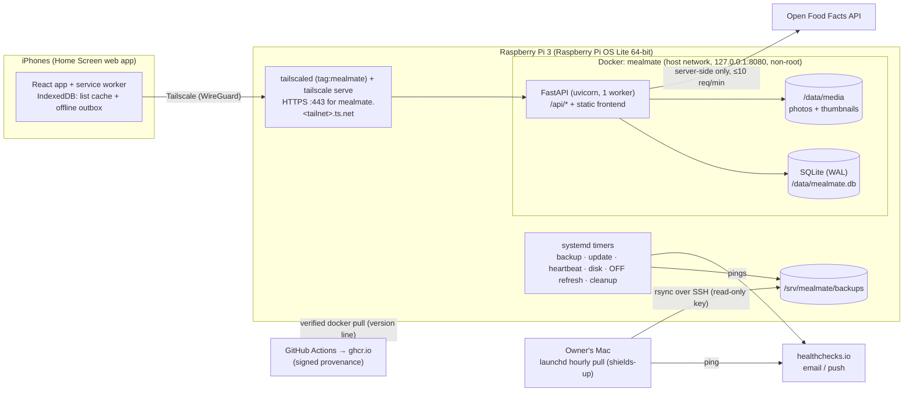

# MealMate v2 — Implementation plan

| | |
|---|---|
| Status | Agreed baseline, 2026-09-26 (reviewed) |
| Requirements | [`requirements.md`](requirements.md) (IDs such as `LIST-04` refer to it) |

This document describes the architecture, the data model, how the code is organised, tested, released and operated, and the milestones in which v2.0 is built.

---

## 1. Principles

1. **Risk first.** The iPhone-specific parts are tested on a real iPhone over Tailscale early (milestone M1), before features are built on top: HTTPS, Home Screen app, login persistence, offline, camera and share sheet.
2. **Backend owns the logic.** Amounts, conversions, aggregation, rounding, nutrition and permissions live in Python and are tested there. The frontend displays and formats (AGG-01, MNT-02).
3. **One contract between frontend and backend.** The contract is the OpenAPI description, and TypeScript types are generated from it (MNT-01).
4. **Small, boring runtime.** The Pi runs one container (Python app plus the built frontend) and a few systemd timers. There are no extra services.
5. **Everything scripted and tested.** This covers setting up a Pi, backup, restore, update and rollback. Nothing depends on remembering manual steps.
6. **Public repo, no secrets.** Defaults are safe, and the Pi only runs verified images (SEC-12).

## 2. Architecture



**Request path:**
- iPhone → Tailscale tunnel → `tailscale serve` (TLS) → `127.0.0.1:8080` → FastAPI.
- `tailscale serve` always sets `X-Forwarded-For` (the client's tailnet IP) and `X-Forwarded-Proto: https`.
- The container uses **host networking** and binds to `127.0.0.1`, so the peer really is `127.0.0.1`, and uvicorn is configured to trust forwarded headers only from there (SEC-05, PLT-05).
- FastAPI serves `/api/*`, and for every other path the built frontend (`index.html` as the fallback for client-side routes).
- Cache headers:

  | Response | `Cache-Control` |
  |---|---|
  | `/api` JSON | `no-store` |
  | Hashed assets | `immutable` |
  | `index.html` and the service worker | `no-cache` |

**Why one container:**
- The frontend is a static build, so a separate web server on the Pi would only cost RAM.
- TLS is handled by Tailscale.
- The separation between frontend and backend is kept at code level (separate projects and toolchains, API-only communication), not at runtime.
- In development the frontend runs on the Vite dev server and proxies `/api`.

## 3. Repository layout

```
MealMate/
├── backend/
│   ├── pyproject.toml, uv.lock
│   ├── alembic.ini, alembic/ (env.py with FK-safe SQLite setup, versions/)
│   ├── app/
│   │   ├── main.py            # app factory, middleware, static frontend
│   │   ├── core/              # config, keys (HKDF), security (JWT, hashing), errors
│   │   │                      # (ErrorCode enum, envelope, handlers), rate limiting,
│   │   │                      # logging, security headers
│   │   ├── db/                # engines (write: BEGIN IMMEDIATE, read), session, base, ids
│   │   ├── models/            # SQLAlchemy models, one module per aggregate
│   │   ├── schemas/           # Pydantic request/response models (= the API contract)
│   │   ├── repositories/      # queries only, no business rules
│   │   ├── services/          # business rules + permission checks (access.py)
│   │   ├── domain/            # pure logic, no I/O: units, nutrients registry, nutrition,
│   │   │                      # aggregation, rounding, needs-more, text normalisation
│   │   ├── integrations/      # Open Food Facts client + validation
│   │   ├── media/             # image processing, signed URLs
│   │   ├── api/               # routers (thin: parse → service → schema)
│   │   ├── cli.py             # `mealmate …` commands (Typer)
│   │   └── seeds/             # categories, cuisines
│   └── tests/
│       ├── unit/              # domain/, services with fakes
│       ├── api/               # HTTP-level tests against a temp SQLite DB
│       └── migrations/        # empty and populated upgrade/downgrade, no autogenerate diff
├── frontend/
│   ├── package.json, vite.config.ts, tsconfig*.json, eslint/prettier config
│   ├── README.md              # handoff: structure, conventions, test IDs, type generation
│   ├── index.html, public/ (icons, manifest assets)
│   └── src/
│       ├── api/               # generated/schema.ts (generated), client.ts, errors.ts
│       ├── app/               # router, providers, layout, bottom tab bar
│       ├── features/          # auth, lists, shopping, meals, ingredients, scanner,
│       │                      # me, admin, couple, sync
│       ├── components/ui/     # shadcn/ui components (copied source)
│       ├── components/        # shared app components
│       ├── i18n/              # de.json, en.json, index.ts, format.ts
│       ├── testIds.ts         # all data-testid values in one place
│       ├── lib/               # small helpers
│       ├── sw/                # service worker (Workbox, injectManifest)
│       └── styles/            # Tailwind entry + design tokens (light/dark)
├── e2e/                       # pytest-playwright suite (Python) + fake_off/ (sidecar)
├── deploy/
│   ├── compose.yml            # production compose for the Pi
│   ├── common/                # prune.py (retention, shared by Pi and Mac) + tests/
│   ├── pi/                    # setup.sh, restore.sh, backup.sh, update.sh, heartbeat.sh,
│   │                          # disk-check.sh, mm-compose, systemd/*, env.example
│   └── mac/                   # install-backup-pull.sh, pull.sh, launchd template
├── compose.dev.yml            # dev: backend (reload) + Vite dev server
├── Makefile                   # make dev | test | e2e | openapi | lint
├── Dockerfile                 # multi-stage production image
├── docs/                      # requirements, plan, operations runbook, guides, checklists
├── .github/                   # workflows, dependabot.yml, PR template
├── LICENSE (AGPL-3.0), README.md, CONTRIBUTING.md, SECURITY.md
```

## 4. Tech stack

| Area | Choice | Notes |
|---|---|---|
| Runtime | Python **3.14** (`python:3.14-slim`, pinned by digest) | `uuid.uuid7()` in the stdlib; aarch64 wheels available for all main dependencies (confirmed in M0, O-8) |
| Web | FastAPI, uvicorn (1 worker) | Single process, as needed for SQLite and in-memory rate limiting |
| DB | SQLite (WAL), SQLAlchemy 2 (`sqlalchemy[asyncio]`, aiosqlite), Alembic (`render_as_batch`) | Pragmas: `foreign_keys=ON` (app only, see § 5.1), `journal_mode=WAL`, `synchronous=NORMAL`, `busy_timeout=5000` |
| Validation / config | Pydantic v2, pydantic-settings (`MEALMATE_` prefix) | |
| Auth | PyJWT (access), opaque refresh tokens, bcrypt | |
| HTTP client | httpx | OFF client; mocked with respx in tests |
| Images | Pillow | Orientation fix, re-encode, strip metadata, 1600 px + 400 px thumbnail |
| CLI | Typer | `mealmate …` inside the container |
| Tooling | uv, ruff, mypy, pytest, pytest-asyncio, Hypothesis, coverage | |
| Frontend | React 19, TypeScript, Vite, react-router | |
| UI | Tailwind CSS v4, shadcn/ui (Radix), lucide-react | Design tokens in CSS variables; light and dark |
| Server state | TanStack Query | |
| API client | openapi-typescript + openapi-fetch | Types generated from `openapi.json` |
| i18n | i18next + react-i18next, `Intl` for formats | |
| PWA / offline | vite-plugin-pwa (Workbox, injectManifest), idb (IndexedDB), `uuid` (v7 for client IDs) | |
| Barcode | zxing-wasm, lazy-loaded, **wasm served by the app** | EAN-13/8, UPC-A/E; typed-in barcode as fallback |
| Frontend tests | Vitest, Testing Library, fake-indexeddb, eslint, prettier, `tsc` | |
| E2E | pytest-playwright (pinned; Chromium + WebKit, iPhone device profiles), axe-core | |
| Node | 26 | LTS from 2026-10-28 |
| CI/CD | GitHub Actions (SHA-pinned), ghcr.io, native arm64 runners (`ubuntu-24.04-arm`), Sigstore attestations | |

## 5. Backend design

### 5.1 Layers, transactions and CPU work

- **Layering:** `api/` (HTTP only) → `services/` (rules, permissions, transactions) → `repositories/` (queries) → `models/`.
  - `domain/` is pure Python without I/O and holds all calculations, so it can be tested exhaustively.
  - Routers never touch the ORM directly.
  - Every endpoint declares a `response_model` and a stable `operation_id`, both needed for type generation.
- **Write transactions use `BEGIN IMMEDIATE`.** The write engine disables the driver's own transaction handling (`isolation_level = None` in a `connect` event) and emits `BEGIN IMMEDIATE` in a `begin` event. The write lock is then held from the first read to `COMMIT`, which makes read-then-write rules atomic: one couple per user, last-write-wins on check state, version increments. `busy_timeout` covers waiting for the lock.
  - Read-only requests use a separate session in the default deferred mode.
  - Write transactions stay short, with no network I/O inside (e.g. OFF calls happen before the transaction).
  - `shopping_lists.version` is incremented atomically (`SET version = version + 1`).
  - A test sends 20 parallel op batches: all succeed and none are lost (QA-01).
- **CPU-heavy work** (bcrypt, the Pillow pipeline) runs via `anyio.to_thread.run_sync`. Image processing runs behind a semaphore of 1, so it never blocks the event loop (PERF-05).
- **Alembic on SQLite:** batch migrations rebuild tables (create a copy → drop the original → rename). With `foreign_keys=ON`, the drop would fire `ON DELETE CASCADE` / `SET NULL` or fail on `RESTRICT`. Therefore:
  - the app's FK pragma listener is attached to the **app engine instance only**;
  - `alembic/env.py` uses its own engine that sets `PRAGMA foreign_keys=OFF` in its `connect` event, outside any transaction;
  - after migrating it runs `PRAGMA foreign_key_check` and exits non-zero (the entrypoint then keeps the pre-migration snapshot, OPS-06) if any rows come back;
  - migrations are tested against a DB filled with demo data (QA-02).

### 5.2 IDs, time and text normalisation

- **Primary keys:** UUIDv7 strings (`uuid.uuid7()`). The server accepts any valid UUID for client-supplied IDs (offline extra items, op IDs) and never relies on their embedded timestamp.
- **Timestamps:** UTC in the database.
- **`*_norm` columns:** lowercase, `ä→ae ö→oe ü→ue ß→ss`, accents stripped, whitespace collapsed. They are used for uniqueness and search (ING-03, REF-01, REF-04, ACC-05).
- **Dictionary order** (ING-03, MEAL-09, D-27): meals and ingredients sort by a key built from the original name: lowercase, `ä→a ö→o ü→u ß→ss`, accents stripped, whitespace collapsed. It is not derived from `*_norm`: folding `ae`/`oe`/`ue` back would also change real letter pairs ("Quelle", "Feuer", "Aloe"). The keys are stored next to the names (`*_sort` columns: the name's, and an ingredient's brand's) and set wherever a name or brand is written.

### 5.3 Errors and headers (I18N-03, SEC-06)

- **Envelope:**

  ```json
  {"code": "meal.not_found", "params": {}, "fields": [{"loc": ["body","name"], "code": "required"}]}
  ```

- Custom handlers make `HTTPException`, `RequestValidationError` (422), rate-limit (429) and unexpected (500) responses all use this envelope.
- `ErrorCode` is one `StrEnum`, exported in OpenAPI.
- A frontend test checks that every code has `de` and `en` translations.
- **CSP**, sent as a header on every response:

  ```
  default-src 'self'; script-src 'self' 'wasm-unsafe-eval'; style-src 'self' 'unsafe-inline';
  img-src 'self' blob: data:; connect-src 'self'; worker-src 'self'; manifest-src 'self';
  object-src 'none'; frame-ancestors 'none'; base-uri 'none'; form-action 'self'
  ```

  - `'wasm-unsafe-eval'` is required for the barcode decoder.
  - `style-src 'unsafe-inline'` is needed because Radix and the toast library inject `<style>` elements at runtime; scripts stay strict.
  - There are no inline scripts; this also rules out an inline theme script and inline PWA registration.
- **Other headers:** `X-Content-Type-Options: nosniff`, `Referrer-Policy: no-referrer`, `Strict-Transport-Security` (when served via HTTPS).
- **Logging:** uvicorn runs with `--no-access-log`. App middleware logs the method, the **route template** (not the concrete path), status and duration, so codes and signed-URL parameters never reach the logs (SEC-10).

### 5.4 Authentication and sessions (ACC, SEC-03, SEC-10)

- **Keys:** `SECRET_KEY` is expanded with HKDF into separate keys for JWT signing, media URL signing and token/code hashing.
- **Rotation:** `setup.sh --rotate-secret` writes a new key. All sessions, open codes and media URLs become invalid, so everyone logs in once.
- **Login:** `POST /api/auth/login` returns `{access_token, expires_in, user}` and sets the refresh cookie `mm_refresh`: `HttpOnly; Secure; SameSite=Strict; Path=/api/auth; Max-Age=90d`.
- **Refresh:** `POST /api/auth/refresh` requires the cookie and the header `X-MealMate-Client: web` (CSRF guard). Refresh tokens are rows in `session_tokens` (stored as HMAC):
  - An **active** token yields a new token. The presented one is marked `superseded_at`, and so is every other still-active token of the same session (leftover grace siblings), so after a normal refresh the session has exactly one live token again.
  - A token superseded **less than 60 s ago** (lost response, parallel refresh) also yields a new token, and nothing is revoked.
  - A token superseded **longer ago** means reuse: the whole session is revoked.
  - Tokens of a session that go unused past the idle limit (90 days) expire.
- **Home Screen fork:** a Home Screen app that starts for the first time (empty IndexedDB) and carries a valid cookie, because iOS may have copied it from Safari (O-10), calls `POST /api/auth/refresh` with `{"fork": true}`. This creates a **new, independent session** for the same user instead of rotating the shared token, so Safari and the Home Screen app can't revoke each other.
  - A fork is accepted only with an **active** token, and at most once per token (`session_tokens.forked_at`).
  - A fork with an already-forked or superseded token returns `auth.login_required` and revokes nothing; the app then shows the login screen once.
  - The new session appears in *Me → Sessions* as its own device.
- **Access tokens:** JWT with HS256, valid 15 min, containing `sub`, `sid` and `iat`, and held only in memory.
- **Per-request check:** one indexed lookup loads the session and user and checks that the session is not revoked, the user is active, and the role. The role is **never** taken from the token, so demoting, deactivating or "log out all devices" take effect immediately.
- **Passwords:** bcrypt with a cost factor tuned in M2 to about 250–500 ms on the Pi 3 (O-7), run in a thread. There is a length check of ≤ 72 bytes and a common-password list (top 10k, bundled).
- **Invite and reset codes:** 32 random bytes, base64url, stored as HMAC.
  - Links carry the code in the **fragment** (`/join#code`, `/reset#code`).
  - The frontend checks it with `POST /api/auth/codes/check` (doesn't consume).
  - Only `POST /api/auth/join` or `/api/auth/reset` consumes it (ACC-04).
- **Login throttling** (ACC-11): an in-memory sliding window per `username_norm` and per `request.client.host` (the real tailnet IP, § 2), with an exponential delay after 5 failures (cap 60 s) and no lockout.
- **Admin activity:** every admin action writes an `admin_events` row (ADM-01, ADM-04). A reset writes a notice the affected user sees (ACC-10).

### 5.5 Authorization (SEC-04)

All permission checks live in one module, `services/access.py`:

| Object | View | Edit |
|---|---|---|
| Meal | owner · partner · everyone if owner.meals_public | owner only |
| List | owner · partner (while in a couple; read-only if not `shared_with_partner`) · everyone (read-only) if owner.lists_public | owner · partner if `shared_with_partner` (not delete/share switch) |
| Meal *embedded in a list* (VIS-06) | if the viewer may view the meal itself (rule above): full details; otherwise "Private meal (N servings)" without name, photo, link or sources | n/a |
| Ingredient | everyone | everyone; delete/merge: admin |
| Photo | same as its meal (checked when the signed URL is issued) | owner |
| Admin endpoints | admin (active) | admin; never private meals/lists; no self-deactivation/deletion; ≥ 1 active admin |

Each rule has API tests, including negative cases and the switch combinations in CPL-02/CPL-04.

### 5.6 Units, nutrition and aggregation (`domain/`)

- **Units:**
  - `Unit` enum with its kind: `g`/`kg` are mass; `ml`/`l`/`tbsp`/`tsp` are volume; `piece` is count.
  - Factors to the base unit of each kind: g, ml, piece.
  - **Base units** (ING-02): `g`, `ml` and `piece`. One rule, `fits(unit, base_unit)`, decides whether an amount fits its ingredient (REF-02): `g` takes `g`, `kg`, `tbsp`, `tsp`; `ml` takes `ml`, `l`, `tbsp`, `tsp`; `piece` takes `piece` or no unit. A row without an amount fits every base unit, and an amount without a unit counts as pieces. The same rule serves meal-row validation, linked extra items, the fits flags in responses (§ 7), and the counts for base-unit changes and merges (§ 6).
  - `convert(amount, unit, to_base, attrs)` uses the ingredient attributes (`base_unit`, `piece_weight_g`, `density_g_per_ml`), which are either live or from a frozen snapshot. It returns the value plus an `estimate` flag (NUT-05), or "not convertible".
    - For lines, it converts across kinds only for a `g` or `ml` base unit with a piece weight or density. Live attributes never have one: they carry no density, and a piece weight only for a `piece` ingredient. So nothing converts across kinds on the lines of live ingredients, nor of rows frozen since D-32 (D-32, D-33).
    - Nutrition does two conversions on top (NUT-05, see "Meal nutrition"): a `piece` ingredient's pieces to grams with its piece weight, and spoons of a `g` ingredient as 1 g/ml, flagged as an estimate.
    - Snapshots taken before D-32 keep the piece weight and density they copied and keep converting with them, so their lists being shopped and done lists don't change (LIST-11, D-08).
- **Nutrients registry:**
  - `NUTRIENTS = [kcal, protein, carbs, sugar, fat]`, each with its OFF field names (`energy-kcal_100g`, `proteins_100g`, `carbohydrates_100g`, `sugars_100g`, `fat_100g`), a plausible range and a display unit.
  - Nullable columns on `ingredients` are generated from it, and so are the schema fields.
  - Adding a nutrient: add it to the registry, run `alembic revision --autogenerate`, add translation keys, and add OFF mapping tests (MNT-06).
- **Ingredient nutrition** (NUT-02): the ingredient's own column per field; `None` is unknown. (Until migration 0007 an ingredient averaged over linked products; D-21 replaced that.)
- **Meal nutrition** (NUT-03/04/05):
  - the sum over rows of the amount in g or ml `/ 100 × value`:
    - a `piece` ingredient's pieces count with its piece weight, against its values per 100 g;
    - spoons of a `g` ingredient count as 1 g/ml, flagged as an estimate;
    - a row that doesn't fit, or pieces without a piece weight, count as unknown;
  - it collects `missing` entries (ingredient + field, or "no amount", "no piece weight", "unit doesn't fit") and `estimate` flags;
  - it returns the totals per meal and per serving.
- **Aggregation** (AGG), `aggregate(list_state) -> [Line]`:
  1. **Sources.** Each list meal contributes rows. If it is live (draft and not detached), the rows come from the current meal with the ingredients' live attributes. If it is frozen (shopping/done, or detached, LIST-15), they come from `list_meal_ingredients` with the attributes and category captured at freezing time. Aggregation knows every category, deleted ones included (D-30): live rows use the ingredient's current category, frozen rows the category captured at freezing time.
  2. Each row gets factor = `list_servings / meal_servings`, and becomes a part `(ingredient, amount × factor, unit, attrs, source)`.
  3. Linked extra items become parts of their ingredient. Once the list has left `draft`, they always use their `attrs_snapshot`. Free-text extra items become their own lines.
  4. **Grouping.** Parts are grouped by line key: `i:<ingredient_id>` for ingredients, `x:<extra_item_id>` for free text.
  5. **Totals.** If all parts with an amount can be converted to the base unit, there is one total. Otherwise there is one **segment** per unit kind (`mass_g`, `volume_ml`, `count`), e.g. "500 g + 2 Stk.". Live parts convert only within the base unit's kind, so spoons of a `g` ingredient and amounts that don't fit become segments of their own, and a `piece` ingredient's total is in pieces (AGG-03). Parts frozen before D-32 still convert with the piece weight and density they copied. Parts without an amount set `has_unspecified`.
  6. **Display rounding** (AGG-04) produces `display: [{value, unit}]`, while the exact segment totals are kept.
  7. **Check state** is applied from `list_line_states` (§ 5.7). Lines hidden in the draft (LIST-07) are returned with `hidden: true`.
  8. **Sort** by category `sort_order`, then name (normalised). A deleted category keeps its last `sort_order`, so ties between categories break by not deleted before deleted, then by category id. The output is deterministic (AGG-05).
- **Tests:** table-driven tests for every rule, the fitting-units table included, plus Hypothesis properties:
  - merging order doesn't matter;
  - scaling by *k* scales totals by *k*;
  - rounding never shows 0 for a positive amount;
  - pieces never round down.

### 5.7 Freezing, detaching and check state

- **Freeze a list meal:** copy the meal's current rows into `list_meal_ingredients`, each with `ingredient_name_snapshot`, `base_unit_snapshot` (`g`, `ml` or `piece`), `piece_weight_g_snapshot`, `density_snapshot` and `category_id_snapshot`, and set `frozen_at`. The meal's name and servings are stored on `list_meals` as soon as it is added. Live ingredients have no density since D-32, so rows frozen from then on have none; rows frozen before keep the density they copied.
- **Start shopping** (LIST-11), in one transaction:
  1. freeze every live list meal, and set `attrs_snapshot` (ingredient name, base unit, piece weight, category; snapshots taken before D-32 also hold a density) on every linked extra item that has none yet;
  2. create a `list_line_states` row for every current line key;
  3. set `status=shopping` and `shopping_started_at`.

  A meal or linked extra item added while shopping is frozen or snapshotted immediately.
- **Detach** (LIST-15) = freeze the list meal, set `meal_id = NULL` and `detached_reason` (`deleted` | `unavailable`).
  - **Triggers:**
    - meal deletion;
    - the owner's `meals_public` switched off: for lists of users who are neither the owner nor the partner;
    - couple ended: for the ex-partner's meals on each other's lists;
    - user deletion (after the transfer of shared lists, before the cascade; § 6).
  - It runs in the same write transaction as the trigger, over all not-yet-frozen list meals affected.
- **Checking a line** stores:
  - `checked`, `checked_at` (client time) and `checked_by`;
  - `checked_snapshot`: a JSON object with the segment totals (`mass_g`, `volume_ml`, `count`), `has_unspecified`, and for free-text lines the `text` and `amount_text` at that moment.
- **"Needs more" (LIST-12)** is computed when the list is read. A checked line is reported as unchecked if any of these holds against `checked_snapshot`:
  - a segment total grew; the difference is returned per grown segment ("+300 g", "+2 Stk.");
  - a new segment or an amount-less part appeared;
  - a free-text item's text or amount changed; this is returned as `changed`.

  Checking it again replaces the snapshot. Nothing needs to be rewritten when the partner adds meals.
- **"New" lines** are lines in `shopping` state that have no `list_line_states` row yet.
- Every change to a list increments `shopping_lists.version`. The version orders ops; polling uses the ETag (§ 5.8).

### 5.8 Offline operations protocol and polling (SYNC)

- **Endpoint:** `POST /api/lists/{id}/ops`, body `{"ops": [{op_id, type, at, payload}]}`. Ops are processed in order in one `BEGIN IMMEDIATE` transaction.

  | `type` | Payload | Rule |
  |---|---|---|
  | `line.check` | `{line_key, checked}` | Last write wins by `at` (ties: higher `op_id`). `at` is clamped to at most server time + 5 min. On a `done` list: applied if `at ≤ finished_at` (SYNC-06), otherwise rejected with `list.done` |
  | `extra.add` | `{extra_id, text, amount_text?, category_id?}` | `extra_id` is created by the client (UUIDv7); a duplicate id means already applied. `category_key` from older clients is still accepted. An unknown or deleted category, or *Uncategorized*, falls back to *Other*, so the op never fails (LIST-06) |
  | `extra.update` | `{extra_id, text, amount_text?}` | Ignored if the item was deleted (delete wins) |
  | `extra.delete` | `{extra_id}` | Soft delete (tombstone) |
  | `list.finish` | `{}` | No-op if already `done` |

- **Idempotency:** `processed_ops(op_id)` makes every op idempotent. The response lists `applied | duplicate | rejected(code)` per op, plus the new list detail.
- **Rejected ops** (list deleted, access lost) come back with a code. The client shows them once and drops them.
- **The online UI uses the same endpoint** for these actions, so there is one code path to test.
- **Polling:** `GET /api/lists/{id}` returns a weak ETag. It is a SHA-256 over the serialized response, which is specific to the viewer, and `If-None-Match` gives `304`.
  - Hashing the response, rather than using `version`, also catches changes that don't touch the list row: meal edits on drafts, ingredient wiki edits, category order, display names, visibility changes.
  - Aggregating ≤ 150 lines per poll is cheap; this is verified by the perf gate in M5b.

### 5.9 Open Food Facts integration (BAR)

- **Client:** `integrations/off.py`, using API **v3** with a pinned minor version (O-4) and `fields=` limited to what we store.
  - The base URL comes from `MEALMATE_OFF_BASE_URL`; in E2E it points to a fake server.
  - It sends `User-Agent: MealMate/<version> (https://github.com/Bublemann/MealMate)` (configurable).
  - httpx uses a total timeout of 10 s (`httpx.Timeout(10.0)`) and a response cap of 1 MB.
- **Validation** (BAR-10) with a Pydantic model:
  - strings are trimmed to name ≤ 200, brand ≤ 100 and quantity ≤ 50 characters;
  - control and bidi characters are removed;
  - nutrients must be finite and within the registry range (e.g. 0–100 g per 100 g, kcal ≤ 900), otherwise they are dropped.
- **Rate limit:** sliding 60-second windows, so OFF never gets more than 10 product reads in any minute from the Pi: the app process may start at most 6 (`OFF_RATE_APP_PER_MINUTE`), the nightly job, which runs as a separate process, at most 4 (`OFF_RATE_JOB_PER_MINUTE`); their sum is checked to be ≤ 10. Excess lookups wait up to 5 s, then return `off.busy`, and the user can retry or enter the values by hand. So the server always answers a lookup within about 15 s. Background refreshes only take a free slot and never wait. Name searches (BAR-11) have their own window, `OFF_SEARCH_PER_MINUTE` (default 5, at most 10, OFF's search limit).
- **Answers:** "not found" only when OFF says so (`product_not_found`, or its redirect for another product type); error pages, 5xx, timeouts and network errors are "unavailable". An interactive lookup or search retries a transient answer once within its deadline; the HTTP client is pooled and closed at shutdown; every outcome is logged (never a search text).
- **Lookup flow:** `GET /api/ingredients/lookup?barcode=`:
  1. validate the check digit;
  2. look for an ingredient with that barcode;
  3. if not found, ask OFF;
  4. return a *proposal* (not saved) with barcode, name (in the user's language, else the generic name, cut at a word boundary to 60 characters), brand, quantity, `product_quantity`, basis, category guess and nutrients.

  With `own_only=true` (the scan in an edit pop-up, BAR-03), step 3 is skipped: the answer only says whether another ingredient has the barcode.

  Saving is `POST /api/ingredients` with the (corrected) values and an `off` block (`off_last_modified_at`, `edited_fields`), which creates a `source=off` ingredient in one request and marks the edited fields as user-edited (BAR-04).
  - **Pack size** (D-38): the pack fields (`quantity_text`, `pack_quantity`, `pack_unit`) are taken only on this create with an `off` block, passed on from the proposal. A create without one, and every `PATCH`, refuses them, so the pack size is never user-edited.
  - **Basis:** a proposal's basis is `g` or `ml`. Switching it to Stück keeps the values, as per 100 g (ING-02).
- **Name search** (BAR-11): `GET /api/ingredients/off-search?q=&page=` on an explicit user action only. It calls OFF's full-text search (`/cgi/search.pl`, `search_simple=1`, 20 per page, sorted by scans, filtered to `en:germany`, `lc` = the user's language, the same `fields=`), because its products have the same shape as the v3 read and pass the same validation. Results are proposals, flagged `in_mealmate` when the barcode already exists; cached 24 h (in-memory LRU, 200 entries); failures are not cached. A weekly contract check covers it. `search.pl` is OFF's legacy full-text search; revisit when their newer search service (search-a-licious) is stable and returns the same product shape.
- **Refresh:**
  - `mealmate jobs off-refresh` runs nightly and refreshes `source=off` ingredients with `fetched_at` older than `MEALMATE_OFF_REFRESH_DAYS`, spread out under the rate limit, with each write in its own short transaction.
  - Opening or scanning such an ingredient triggers a background refresh.
  - Fields that were not user-edited update silently, and so do the pack fields, always. User-edited fields with different values are stored in `pending_update` (BAR-06). Pack fields never go there: "user-edited" marks on them from before D-38 are ignored, not rewritten.
  - Apply and Ignore endpoints clear it. Ignore also remembers the ignored OFF `last_modified`, so the same values aren't suggested again.

### 5.10 Media (MEAL-04, SEC-07, VIS-05)

- **Upload:** `PUT /api/meals/{id}/photo`, multipart, rate-limited per user. Processing happens in a thread behind a semaphore of 1:
  1. `Image.open(f, formats=["JPEG","PNG","WEBP"])`, at most 10 MB. Right after `open()`, reject the image if `width × height > 24_000_000`. `MAX_IMAGE_PIXELS` alone only warns up to twice its value, so `DecompressionBombWarning` is also turned into an error;
  2. `draft()` for JPEG to cut decode memory;
  3. `ImageOps.exif_transpose()` to rotate the image upright;
  4. re-encode to WebP (1600 px on the long edge, q≈80, plus a 400 px thumbnail), which drops all metadata including GPS;
  5. store as `/data/media/<random-uuid>.webp`.
- **Delivery:** meal responses contain **signed URLs**: `/api/media/<key>?exp=…&sig=…`, HMAC-signed.
  - The expiry is `now + 1 h`, rounded up to the next full hour, giving a lifetime of 1–2 h. URLs stay identical within an hour, so they are cacheable.
  - They work in `` tags without an `Authorization` header, and are only issued after the view check.
  - The response header is `Cache-Control: private, max-age=3600`.
- **Copies:** copying a meal duplicates its files.
- **Cleanup:** `mealmate jobs cleanup` removes orphaned files.

### 5.11 CLI (`mealmate`)

| Command | Purpose |
|---|---|
| `create-admin [--username U --password-stdin]` | First admin, interactive or non-interactive (ACC-12; tests) |
| `reset-link <username>` | Print a reset link and reactivate the account (last-admin recovery) |
| `db upgrade` | Snapshot the DB to `pre-migrate/` if migrations are pending (keep last 3), then run the migrations (§ 5.1). Used by the entrypoint |
| `backup-db <path>` | Consistent snapshot via the SQLite backup API plus `PRAGMA integrity_check` (OPS-01) |
| `jobs off-refresh` · `jobs cleanup` | Background jobs, called by systemd timers. Cleanup removes expired codes, ops older than 30 days, expired session tokens and orphaned media |
| `export-openapi <path>` | Writes `openapi.json` without starting a server (for type generation) |
| `seed-demo` | Demo users (admin, a couple, a single user), ingredients (some with brand and barcode, one thing in two brands), meals with photos, drafts, a shopping list and history. Refuses to run if real users exist |

### 5.12 Configuration (`MEALMATE_` environment variables)

| Variable | Default | Notes |
|---|---|---|
| `SECRET_KEY` | **none (required)** | Expanded with HKDF (§ 5.4) |
| `PUBLIC_URL` | none (required in prod) | e.g. `https://mealmate.tail1234.ts.net`, used to build invite/reset links |
| `DATA_DIR` | `/data` | Holds `mealmate.db`, `media/`, `pre-migrate/`, `status/` |
| `COOKIE_SECURE` | `true` | May only be `false` when `PUBLIC_URL` is a loopback address (E2E, § 9) |
| `OFF_BASE_URL` | `https://world.openfoodfacts.org` | |
| `OFF_REFRESH_DAYS` | `30` | |
| `OFF_USER_AGENT_CONTACT` | repo URL | |
| `OFF_RATE_APP_PER_MINUTE` / `OFF_RATE_JOB_PER_MINUTE` | `6` / `4` | Requests to OFF per 60 s from the app and from the nightly job; together ≤ 10 (BAR-08) |
| `OFF_SEARCH_PER_MINUTE` | `5` | OFF name searches per 60 s (1–10, BAR-11) |
| `INVITE_TTL_DAYS` / `RESET_TTL_HOURS` | `7` / `24` | |
| `SESSION_IDLE_DAYS` | `90` | |
| `API_DOCS_ENABLED` | `false` | `true` in dev |
| `DIAGNOSTICS_ENABLED` | `false` | M1 only (removed in M9): registers `/api/auth/diag/*` for the `/diag` screen; passed through by the Pi's compose file from `/srv/mealmate/.env` |
| `LOG_LEVEL` | `INFO` | JSON logs to stdout |

- **Uvicorn** is configured through `UVICORN_*` variables. The image default is `UVICORN_HOST=0.0.0.0`, which CI and E2E need with a port mapping. The Pi's compose file sets `UVICORN_HOST=127.0.0.1`, and host networking must never bind `0.0.0.0` (§ 11.1). `--forwarded-allow-ips 127.0.0.1` is fixed.
- **Host-only variables** in `/srv/mealmate/.env` (never passed into the container):
  - `IMAGE_TAG` (e.g. `2.0-pre`, later `2.0`);
  - `HC_HEARTBEAT_URL`, `HC_BACKUP_URL`, `HC_UPDATE_URL`, `HC_DISK_URL`.

## 6. Data model

All tables have `id` (UUIDv7) plus `created_at`/`updated_at` unless stated otherwise. FK = foreign key; the action is what happens on delete.

| Table | Key columns | Notes |
|---|---|---|
| `users` | `username`, `username_norm` (unique), `display_name`, `display_name_norm` (unique), `password_hash`, `role` (`user`/`admin`), `language` (`de`/`en`), `is_active`, `meals_public`, `lists_public`, `filter_hidden` (JSON `{meals: [user ids], lists: [user ids], list_states: [states]}`), `last_seen_at`, `password_changed_at`, `password_reset_by`, `password_reset_at` | `filter_hidden` holds the saved filter preferences as what they hide: `meals` the user filter on Meals (MEAL-10), `lists` the user filter on Lists and `list_states` the state filter next to it (`draft`/`shopping`/`done`, UI-02). Empty shows everything; migration 0011 gave every row saved before the state filter an empty one, so it shows every state |
| `sessions` | `user_id` FK cascade, `revoked_at`, `last_used_at`, `user_agent` | One per device/login |
| `session_tokens` | `session_id` FK cascade, `token_hmac` (unique), `issued_at`, `superseded_at`, `forked_at`, `expires_at` | Refresh-token rotation with grace and one-time fork (§ 5.4) |
| `one_time_codes` | `kind` (`invite`/`reset`), `code_hmac` (unique), `created_by` FK set null, `target_user_id` FK cascade (reset), `expires_at`, `used_at`, `used_by` FK set null, `revoked_at`, `tailscale_share_url` (invite, optional) | |
| `couples` | `requester_id` FK cascade, `addressee_id` FK cascade, `status` (`pending`/`accepted`), `accepted_at` | |
| `couple_members` | `user_id` PK FK cascade, `couple_id` FK cascade | Filled on accept; the primary key enforces "one couple per user" |
| `categories` | `key` (unique, nullable), `name_de`, `name_de_norm`, `name_en`, `name_en_norm`, `sort_order`, `deleted_at` | Seeded by migration with key and both names (requirements Appendix A); *Uncategorized* (`uncategorized`) starts last. Admin-added categories have no key; the key identifies *Other* and *Uncategorized* and drives the OFF category guess (§ 5.9). One name column, with its `_norm`, per UI language: a language added later gets an empty one, and the English name shows until admins fill it in (I18N-01, D-31). Names are unique per language among the categories that aren't deleted (REF-01). `deleted_at` marks a deleted category (D-30): it keeps its last `sort_order`, while the others keep a gap-free order. Each downgrade refuses while it would lose data: categories without a key, deleted categories, or ingredients in *Uncategorized* |
| `cuisines` | `key` (unique, nullable), `name` (nullable), `name_norm` (unique), `created_by` FK set null | Seeded entries have a `key`; user-added ones have a `name` |
| `tags`, `meal_tags` | `name`, `name_norm` (unique) · (`meal_id`, `tag_id`) | |
| `ingredients` | `name`, `name_norm` (indexed, not unique), `name_sort` (indexed), `brand`, `brand_norm`, `brand_sort`, `barcode` (unique, nullable), `category_id` FK, `base_unit` (`g`/`ml`/`piece`), `piece_weight_g` (only for `piece`), nutrient columns (nullable), `quantity_text`, `pack_quantity`, `pack_unit`, `source` (`manual`/`off`), `off_last_modified_at`, `fetched_at`, `user_edited_fields` (JSON), `pending_update` (JSON), `ignored_off_modified_at`, `created_by`/`updated_by` FK set null | One kind of ingredient (D-21, migration 0007 merged the former `products` table into it); migration 0014 dropped `density_g_per_ml` and cleared the piece weight of `g` and `ml` ingredients (D-34); the pack size comes only from OFF (D-38) and is stored for the postponed pack-rounding feature; `name_sort` and `brand_sort` are the dictionary-order keys (§ 5.2, migration 0008) |
| `meals` | `owner_id` FK cascade, `name`, `name_norm`, `name_sort` (indexed), `instructions`, `source_url`, `servings`, `cuisine_id` FK set null, `photo_key`, `copied_from_meal_id` FK set null | `name_sort` is the dictionary-order key (§ 5.2, migration 0008) |
| `meal_ingredients` | `meal_id` FK cascade, `position`, `ingredient_id` FK restrict, `amount`, `unit`, `note` | |
| `shopping_lists` | `owner_id` FK cascade, `name` (nullable → translated default), `status`, `shared_with_partner`, `version`, `reminder_seed`, `shopping_started_at`, `finished_at` | |
| `list_meals` | `list_id` FK cascade, `meal_id` FK set null, `servings`, `meal_servings_snapshot`, `meal_name_snapshot`, `meal_owner_id_snapshot`, `added_by` FK set null, `frozen_at`, `detached_reason` | Unique (`list_id`, `meal_id`) while `meal_id` is not null |
| `list_meal_ingredients` | `list_meal_id` FK cascade, `ingredient_id` FK restrict, `ingredient_name_snapshot`, `base_unit_snapshot` (`g`/`ml`/`piece`), `piece_weight_g_snapshot`, `density_snapshot`, `category_id_snapshot`, `amount`, `unit`, `note` | Frozen copy (LIST-11/15). The snapshot columns stay; `density_snapshot` is only set on rows frozen before D-32 (§ 5.7) |
| `list_extra_items` | `list_id` FK cascade, `ingredient_id` FK restrict (nullable), `attrs_snapshot` (JSON; set at Start shopping, or immediately when added outside `draft`), `text`, `amount`, `unit`, `amount_text`, `category_id` FK, `added_by` FK set null, `deleted_at` | `id` may be generated by the client; an `attrs_snapshot` holds a density only when it was taken before D-32 |
| `list_line_states` | PK (`list_id`, `line_key`), `checked`, `checked_at`, `checked_op_id`, `checked_by` FK set null, `checked_snapshot` (JSON), `hidden` | `checked_op_id` breaks ties in last-write-wins (§ 5.8) |
| `processed_ops` | `op_id` PK, `user_id`, `list_id`, `applied_at` | Pruned after 30 days |
| `admin_events` | `actor_id` FK set null, `action`, `target_user_id` FK set null, `details` (JSON), `created_at` | Admin activity log (ADM-01). Categories: `category.create` (names), `category.rename` (old and new names), `category.delete` (names, number of ingredients moved and of free-text items moved), `category.reorder` |

**Deletion and lifecycle rules** (all in one write transaction each):
- **Meal deleted** (MEAL-07): detach it from every not-yet-frozen list (§ 5.7), then delete it.
- **Meals switched to private:** detach the owner's meals from not-yet-frozen lists owned by users who are neither the owner nor the partner.
- **Couple ended** (CPL-05):
  - set `shared_with_partner = false` on all lists of both users;
  - detach each ex-partner's meals from the other's lists, where they are no longer visible;
  - delete the `couple_members` rows.
- **User deactivated** (ADM-02): revoke their sessions and cancel their pending couple requests.
- **User deleted** (ADM-03), in this order:
  1. transfer their shared lists to the partner (`owner_id` changes and `shared_with_partner` becomes false);
  2. detach their meals from every not-yet-frozen list they don't own, which now includes the transferred lists;
  3. end the couple;
  4. cascade: meals, other lists, sessions, codes;
  5. media files are removed by the cleanup job.
- **Category deleted** (REF-01, D-30); refused for *Other* and *Uncategorized*:
  1. every ingredient of the category moves to *Uncategorized*. This isn't an edit of the ingredient: `updated_by` stays;
  2. free-text extra items on drafts that aren't tombstoned move to *Other*;
  3. nothing on lists being shopped or done lists changes: their frozen lines (`category_id_snapshot`) and free-text items keep pointing to the category, so those foreign keys stay RESTRICT, and linked extra items keep it in their `attrs_snapshot`;
  4. `deleted_at` is set, and the remaining `sort_order` closes the gap;
  5. a `category.delete` admin event records the names and both counts.

  Afterwards, "Shop again" and copies put free-text items whose category is deleted into *Other*. Creating or updating an ingredient refuses a deleted category and *Uncategorized*, except an update that leaves an uncategorized ingredient's category unchanged; adding or changing a free-text item over the REST API refuses them too (LIST-06).
- **Ingredient merge** (ING-05) repoints `meal_ingredients`, `list_meal_ingredients` and `list_extra_items`, moves A's barcode to B if B has none, rewrites `list_line_states.line_key` (`i:A` → `i:B`, merging check states: checked only if both were checked), then deletes A. A and B may have different base units. Nothing is converted: A's amounts that don't fit B are kept and flagged (D-33). When there are any (meal rows and linked extra items on drafts), the merge is refused with a conflict naming their number, unless the request accepts that.
- **Base unit change** (ING-02) converts nothing: the values stay, now per 100 g (`g`, `piece`) or 100 ml (`ml`), and pending OFF nutrient updates are dropped. Changing away from `piece` clears the piece weight; a piece weight for a `g` or `ml` ingredient is refused. When meal rows or linked extra items on drafts would stop fitting (§ 5.6), the update is refused with a conflict naming the number of meals and lists affected, unless the request accepts that; those amounts are then kept and flagged (D-33).
- **Base-unit migration** (D-34, migration 0014), in one transaction; a downgrade is refused while there are ingredients (the backup taken before the update is the way back):
  1. a `g` or `ml` ingredient becomes `piece` when at least one meal row or linked extra item on a draft uses it with an amount, and every such amount is in pieces (`piece` or no unit). Rows without an amount don't count, nor do deleted extra items, frozen rows and the extra items of lists being shopped and done lists. It keeps its piece weight and its values per 100 g; a former `ml` ingredient with a density has its values converted from per 100 ml to per 100 g with it (a value above the nutrient's maximum becomes unknown, as from OFF), one without keeps them as they are. A former `ml` ingredient's pending OFF nutrients go, as with a base-unit change; ignored ones stay remembered;
  2. every other ingredient keeps its base unit and loses its piece weight;
  3. `ingredients.density_g_per_ml` is dropped. The frozen rows' `piece_weight_g_snapshot` and `density_snapshot` and the extra items' `attrs_snapshot` stay, so lists being shopped and done lists don't change (D-08).

## 7. API outline

All endpoints are under `/api`, return JSON, and use the error envelope. The source of truth is the generated OpenAPI description.

| Group | Endpoints |
|---|---|
| System | `GET /health` (DB + disk writable) · `GET /version` (version, commit, source URL) |
| Auth | `POST /auth/login` · `/auth/refresh` (`{fork?}`) · `/auth/logout` · `/auth/logout-all` · `/auth/codes/check` · `/auth/join` · `/auth/reset` |
| Me | `GET/PATCH /me` (display name, language, privacy, and in `filter_hidden` the user filter for meals and for lists and the state filter, § 6) · `POST /me/password` · `GET /me/sessions` · `DELETE /me/sessions/{id}` · `GET /me/security` (reset notices) |
| Couple | `GET /couple` · `POST /couple/requests` · `POST /couple/requests/{id}/accept\|decline\|cancel` · `DELETE /couple` |
| Users | `GET /users` (active users: id + display name, for the couple picker) · `GET /users/visible?for=meals\|lists` (the choices of the user filter on Meals or Lists: oneself first, the partner, then everyone else whose matching privacy switch is public, by display name, VIS-02) |
| Reference | `GET /categories` (every category, deleted ones included, because old lists and the offline copy need their names; by `sort_order`. Each with `id`, `key` or null, `names` by language (`de`, `en`), `sort_order`, `deleted` and its number of ingredients) · `GET /units` · `GET/POST /cuisines` · `GET /tags?q=` |
| Ingredients | `GET /ingredients?q=&category_id=` (`q` searches name and brand; `category_id` is repeatable and matches any of them; without `q` sorted in dictionary order by name, then brand (§ 5.2); with `q` the best matches first, then the same order) · `POST` (pack fields are refused without an `off` block, § 5.9) · `GET/PATCH /ingredients/{id}` (`PATCH` refuses pack fields; a base-unit change that would leave amounts not fitting answers 409 with the number of meals and lists affected, unless the request accepts that, § 6). No density in input or output; a piece weight only for `piece` · `GET /ingredients/similar?name=&brand=` · `GET /ingredients/lookup?barcode=&own_only=` (`own_only` skips OFF, § 5.9) · `GET /ingredients/off-search?q=&page=` · `POST /ingredients/{id}/barcode` (link a barcode to an ingredient without one; 409 otherwise) · `POST /ingredients/{id}/pending-update/apply\|ignore` |
| Meals | `GET /meals?q=&cuisine_id=&tag_id=&owner_ids=` (`cuisine_id` and `tag_id` are repeatable: a meal matches if its cuisine is any of the given ones and it has every given tag; sorted in dictionary order (§ 5.2); without `owner_ids` the user filter on Meals applies, with `owner_ids` (repeatable) only those owners' meals are listed) · `GET /meals/tags` (the tags of all visible meals: the choices of the tag filter) · `GET /meals/recent` (the picker's "recently used") · `POST` · `GET/PATCH/DELETE /meals/{id}` (every row carries a flag saying whether its unit fits, § 5.6; create and update refuse a row whose unit doesn't fit with a field error on that row's unit, except a row identical to one the meal already has: same ingredient, amount and unit) · `POST /meals/{id}/copy` · `PUT/DELETE /meals/{id}/photo` · `GET /media/{key}` |
| Lists | `GET /lists?cursor=` (the list feed, UI-02: every list you can see, in every state, with your user filter and state filter applied; newest created first, ties by id; 30 per page, with a `next_cursor` for the next page, null on the last) · `POST /lists` · `GET/PATCH/DELETE /lists/{id}` · `POST /lists/{id}/meals` · `PATCH/DELETE /lists/{id}/meals/{list_meal_id}` · `POST /lists/{id}/extra-items` · `PATCH/DELETE …/extra-items/{id}` (a linked item carries the same fits flag; adding or editing one refuses a unit that doesn't fit, while an existing one that doesn't fit is kept) · `POST /lists/{id}/lines/{key}/hide\|unhide` · `POST /lists/{id}/start-shopping\|reopen\|shop-again\|copy` · `POST /lists/{id}/ops` (§ 5.8; `extra.add` names the category by id) · `GET /lists/sync` (all editable draft/shopping lists for the offline copy) |
| Admin | `GET/PATCH /admin/users[/{id}]` (role, active) · `DELETE /admin/users/{id}` · `GET/POST /admin/invites` · `DELETE /admin/invites/{id}` · `POST /admin/users/{id}/reset-link` · `PUT /admin/categories/order` (a permutation of the categories that aren't deleted, *Uncategorized* included) · `POST /admin/categories` (both names; 201, goes last) · `PATCH /admin/categories/{id}` (rename: both names; refused for *Uncategorized*) · `GET /admin/categories/{id}/usage` (the number of ingredients and of free-text items on drafts, for the delete confirmation) · `DELETE /admin/categories/{id}` (§ 6; refused for *Other* and *Uncategorized*). A taken name is a field error on that language's name; a deleted category is "not found" for rename and delete · `POST /admin/ingredients/{id}/merge` (409 with the number of A's amounts that won't fit B, unless the request accepts that, § 6) · `DELETE /admin/ingredients/{id}` · `GET /admin/events` · `GET /admin/system` (version, plus backup and disk status read from the read-only `/status/*.json`) · `POST /admin/backup` (creates `/data/status/backup-request`, picked up by a systemd path unit) |
| Diagnostics (M1 only, removed in M9) | `POST /auth/diag/set\|check` (cookie carry-over test, under `/api/auth` so the cookie path matches) · `GET /auth/diag/request` (the client address, scheme and forwarding headers as the app sees them, O-3) |

## 8. Frontend design

- **Routing** (react-router):
  - tabs `/lists`, `/meals`, `/ingredients`, `/me`;
  - `/lists/:id` (draft view / shopping view), `/meals/new` (the "Neues Gericht" tile can pass a name to prefill, MEAL-09), `/meals/:id`, `/meals/:id/edit`, `/ingredients/:id`;
  - there is no `/scan` route: the former scan page's address redirects to the Ingredients tab (BAR-01, D-37);
  - the former history route `/lists/history` redirects to the Lists tab (UI-02);
  - `/join`, `/reset`, `/login`, `/me/admin/*`. The code is read from `location.hash` and removed from the URL immediately.
- **Server state:** TanStack Query per feature (`features/*/api.ts`), all calls through `src/api/client.ts` (openapi-fetch).
  - The client gives every request an `AbortController` timeout: 8 s for reads, 15 s for ops and uploads, and 25 s for the barcode lookup and the OFF name search. A timeout counts as "can't reach MealMate" (SYNC-09). A lookup timeout instead shows "Open Food Facts is slow – try again or enter the values yourself".
  - The auth middleware refreshes **single-flight**: one shared promise, plus `navigator.locks.request('mm-refresh')` across tabs, then retries once on 401. No API call is sent before the startup refresh has settled.
- **Per-tab memory** (UI-01): the search text and the cuisine, tag and category choices live in an in-memory, app-wide store keyed by tab, not in the URL or browser storage, so they are lost when the app closes. The user filter and the state filter are server state (`/me`).
- **Auth:**
  - The access token lives in memory.
  - On start: render the cached profile and lists from IndexedDB **first**, then refresh in the background.
  - A first standalone start with empty storage uses the Home Screen fork (§ 5.4).
  - The server tells "session revoked / user deactivated" apart from "expired" with distinct error codes, which drive SYNC-10.
- **Sync module** (`features/sync/`):
  - an IndexedDB store `lists` for the offline copy (SYNC-02), refreshed from `GET /lists/sync` on start, `visibilitychange`, `online` and after each mutation;
  - the copy seeds the first page of the list feed: the Lists tab shows it, sorted like the feed, until that page arrives, and offline it shows only the copy, ignoring the saved filters (UI-02). A list finished on this phone whose finish wasn't sent yet is left out;
  - the category list, cached per user in the `meta` store with every category's names, deleted ones included (D-30), so stored lists show every heading offline (LIST-11). It is loaded again with the copy once it is stale, whichever screen is open; a cached list without names (stored by an app version before D-31) is not used;
  - an `outbox` store for ops (SYNC-03/04), tagged with the user id. Ops are only sent with a session of the same user id. A pending free-text item (`extra.add`) sends its category's id;
  - a flush loop that runs on start, `visibilitychange→visible` and `online`, in order, stopping at the first network error or timeout;
  - a status store feeding the indicator (SYNC-07);
  - `navigator.storage.persist()` requested after login;
  - the lifecycle rules of SYNC-10 (wipe on logout/revocation, keep only the same user's outbox).
- **Service worker:**
  - precaches the app shell, including `index.html` and translations;
  - navigations are served **from the precache** (`NavigationRoute(createHandlerBoundToURL('/index.html'))`), so the app opens instantly even on lie-fi;
  - new versions arrive through the normal service-worker update flow (a toast offers "reload");
  - `/api/*` is never cached by the service worker.
- **Shopping view:**
  - rendered from the list detail (online) or the IndexedDB copy (offline);
  - optimistic updates for queued ops;
  - checked lines go into the "In the cart" section;
  - there are badges "+300 g" / "changed" for lines that need more (LIST-12);
  - polling every 5 s while visible, with `If-None-Match`.
- **Scanner:** a lazily loaded chunk without a route of its own (PERF-03). The scan icon in "Neue Zutat" and in the edit pop-up, and the meal form's "Barcode scannen", open it over the pop-up or the form, and only then is it loaded and the camera started (BAR-01). It hands the barcode back; the lookup (`GET /ingredients/lookup`) and what follows (BAR-02/03) belong to the pop-up and the meal form, so the scanner doesn't import the ingredient form.
  - The wasm binary is bundled and served by the app (`import wasmUrl from 'zxing-wasm/reader/zxing_reader.wasm?url'` plus `prepareZXingModule({overrides: {locateFile}})`), never loaded from a CDN (SEC-08).
  - It uses the camera through `getUserMedia({video: {facingMode: "environment"}})`.
  - It shows a manual barcode input when the camera is unavailable or denied.
- **Share:**
  - `navigator.share({text})` must run within the browser's user-activation window (about 5 s after the tap), so share buttons only share data that is already loaded:
    - export text is built synchronously;
    - invite and reset links are created first ("Create invite") and shared with a second tap ("Share"), ACC-03.
  - Clipboard fallback.
  - The export text is built by `features/lists/exportText.ts` (unit-tested) from the display values the backend already rounded.
- **i18n:**
  - `de.json` / `en.json` with flat keys: `feature.screen.element`, errors as `error.<code>`, units as `unit.<unit>`, reminders as `reminder.<n>`;
  - category names are not in these files but come from the API (I18N-04, D-31): one helper shows a category's name in the UI language, else in English;
  - `format.ts` wraps `Intl.NumberFormat`/`DateTimeFormat` (`de-DE`, `en-GB`);
  - `parseAmount()` accepts `,` and `.`.
- **Keyboard** (UI-01, D-28): one viewport module watches `visualViewport` (`resize`, `scroll`), derives the keyboard height, ignores it while pinch-zoomed (`scale` ≠ 1) and does nothing where the API is missing. It exposes the inset as a CSS variable and a "keyboard open" state: the dialogs size themselves to the visible area, and the tab bar and the update prompt hide.
- **Design tokens:** CSS variables (green accent, neutral grays, light and dark) in `styles/tokens.css`, mapped into the Tailwind theme. Dark mode uses only `prefers-color-scheme` (no inline script). shadcn components use only tokens.
- **Testability:**
  - every interactive element has an accessible name;
  - key elements get a `data-testid` from `src/testIds.ts`, and the README list is generated from it;
  - ESLint bans `dangerouslySetInnerHTML` (SEC-13).

## 9. Testing strategy

| Layer | What | Where / when |
|---|---|---|
| Domain unit | Units, conversion, nutrition, aggregation, rounding, needs-more, normalisation (table-driven + Hypothesis) | `backend/tests/unit`, every PR |
| Services / API | Every endpoint; permissions (positive and negative, incl. VIS-06 and CPL-02/04 combinations); detach and deletion rules (incl. deleting a user whose shared draft contains their own meal); refresh grace (lost response, two parallel refreshes → afterwards exactly one active token) and fork (second fork refused, stale token → login, no revocation); ops idempotency and conflict rules; 20 parallel ops (no lost updates); rate limits; OFF client and validation (respx); image pipeline; production cookie attributes | `backend/tests/api`, every PR, coverage gate ≥ 85 % |
| Migrations | Empty → head → base → head; **seed-demo DB at the previous head → head with unchanged row counts and unchanged counts of non-NULL values in every nullable FK column** (a migration that moves data by design, like 0007, asserts exactly its intended changes), `foreign_key_check` empty, no `_alembic_tmp_*`; no autogenerate diff. Since the models only describe the head, older revisions are seeded from frozen SQL dumps of the seed-demo DB (`tests/migrations/fixtures/demo-0006.sql`, and `demo-0013.sql`: that one migrated to 0013, with what the base-unit migration sorts out) | `backend/tests/migrations`, every PR |
| Frontend | API client (timeouts, single-flight refresh), `parseAmount`/format, outbox, flush and lifecycle (fake-indexeddb), export text, i18n completeness (keys, placeholders, error codes), barcode decoding of sample EAN images | Vitest, every PR |
| E2E | The 11 journeys in QA-04 plus a lie-fi case (`page.route` never answers) and a "no request leaves the origin" assertion; axe checks | `e2e/`, every PR |
| Deploy | `docker compose config` of `deploy/compose.yml` with the example env; backup → restore round trip (including a stale `-wal` file); update rollback with a deliberately unhealthy image (asserting the schema revision and a sentinel row, not only `integrity_check`), then recovery with the next good digest; retention pruning (`deploy/common/tests`) | CI (in containers) |
| Performance | `e2e/perf/list_p95.py`: 20 meals / 150 lines, 3 clients polling every 5 s, p95 for 200 and 304 | On the Pi pre-release: M1 (skeleton), M5b (gate), M9 |
| Manual | QA-06 checklist on a real iPhone (`docs/release-checklist.md`) | Before each release tag |

**E2E setup details:**
- The built image runs with `MEALMATE_PUBLIC_URL=http://127.0.0.1:<port>` and `MEALMATE_COOKIE_SECURE=false`. The reason: WebKit (and libsoup on Linux) never stores or sends `Secure` cookies over plain HTTP, even on localhost. The production cookie attributes are verified by an API test, and the real HTTPS behaviour by M1 and QA-06.
- **Fake OFF:** a tiny FastAPI sidecar in `e2e/fake_off/` that serves recorded v3 fixtures. It is never part of the production image. Journey 3 types the barcode into the manual input (BAR-01).
- **Fixtures** (skeleton in M0, completed in M2 when the endpoints exist): `admin` (via `create-admin --password-stdin`), `invite_user()` and `make_couple()` through the API.
- **Offline reload:** reloading while offline with a service worker currently fails in Playwright WebKit (upstream issue, O-11). That step runs in Chromium; WebKit covers offline check-off without a reload. The skip is documented in code and rechecked on every Playwright upgrade.

## 10. Branching, CI/CD and releases

### 10.1 Branches (D-03)

- **`main`:** integration branch. **Feature and fix PRs are squash-merged** (Conventional Commit titles: `feat:`, `fix:`, `docs:` …). No images are built from `main`.
- **`release/X.Y`:** created from `main` when a version is ready. Hotfixes go into `release/X.Y` through pull requests.
- **Sync PRs** (`main → release/X.Y` before a pre-release) and **back-merge PRs** (`release/X.Y → main` after a hotfix) always use **"Create a merge commit"**, never squash, so the branches keep a shared history. The rulesets allow both merge methods.
- After each release on `release/X.Y`, a back-merge PR into `main` is **opened automatically and merged by the owner**.
- **Before 2.0.0:** pre-releases (`v2.0.0-alpha.N`, `-beta.N`, `-rc.N`) are tagged on `release/2.0`, which is updated from `main` through a sync PR for each pre-release. After `v2.0.0`, `release/2.0` only receives fixes.
- **Tags:** `vX.Y.Z[-pre]` exist only on commits of `release/*` branches. The build workflow enforces this.

### 10.2 Workflows

**Release credentials:** a small **GitHub App** ("MealMate Release Bot", permissions: contents + pull requests write), installed only on this repo. Its token comes from `actions/create-github-app-token` and is used to push tags and open back-merge PRs. Tags and PRs created with this token trigger workflows normally; ones created with `GITHUB_TOKEN` don't. The App is the bypass actor of the `release/**` branch ruleset (release-cut creates the branch, and a PR rule also blocks creating a matching branch) and of the `v*` tag ruleset. Personal-account repos can't use the built-in GitHub Actions integration as a bypass actor.

| Workflow | Trigger | Does |
|---|---|---|
| `ci.yml` | PR, push to `main` and `release/**` | backend: ruff, mypy, pytest + coverage, migration tests · frontend: eslint, prettier, tsc, vitest, build, **OpenAPI type drift check** · e2e: build image (amd64), fake OFF sidecar, Chromium + WebKit suites · deploy checks (§ 9) · security: gitleaks, pip-audit / npm audit (runtime deps, high+), licence check |
| `release-cut.yml` | manual (`version: X.Y`) | Creates `release/X.Y` from `main` (App token) |
| `release-publish.yml` | manual on `release/X.Y` (`kind: final \| patch \| alpha \| beta \| rc`) | Requires green CI on the branch head. Computes the version (`final` produces `X.Y.0`, or strips the pre-release suffix; `patch` produces `X.Y.(n+1)`). Pushes the tag with the App token, which triggers `build-image.yml`. Creates the GitHub Release: notes from the merged PR titles (git-cliff) plus the **deploy bundle** and `setup.sh` as assets, with SHA-256 sums in the notes. Opens the back-merge PR if needed |
| `build-image.yml` | push of a `v*` tag (App or human) | Verifies the tag is on `release/*`. Builds natively on `ubuntu-24.04` (amd64) and `ubuntu-24.04-arm` (arm64), pushes by digest, then a multi-arch manifest to `ghcr.io/bublemann/mealmate`, tagged with the exact version only. The next job signs the provenance with `actions/attest` (`subject-name: ghcr.io/bublemann/mealmate`, `subject-digest: <manifest-list digest>`, `push-to-registry: true`, so the attestation lives next to the image in ghcr.io; Sigstore). Only this job gets `id-token`, `attestations` and `artifact-metadata` write. **The moving tags (`X.Y`, `X.Y-pre`, `latest`) come last**, after the attestation exists, on the same digest (`imagetools create`, no rebuild), so the Pi never sees an unsigned digest on the tag it follows |
| `image-scan.yml` | weekly (schedule) | Scans the currently published `X.Y` images (Trivy, fixable high/critical) and runs pip-audit/npm audit on each `release/*` branch. Opens an issue on findings (SEC-11). Ends by pinging `HC_SCAN_URL` (an Actions secret), so an alert fires if the scan stops running, e.g. because GitHub disabled scheduled workflows after 60 days without repo activity |
| Dependabot | weekly | pip (uv), npm, Docker base images (digest), GitHub Actions (SHA pins); grouped minor/patch updates; target `main` |

- **Image tags:**
  - final releases get `X.Y.Z`, `X.Y` and, only if it is the highest version overall, `latest`;
  - pre-releases get their exact tag plus a moving `X.Y-pre` (never `X.Y` or `latest`), so the Pi can follow pre-releases from M1 on.
- **Labels:** OCI labels `org.opencontainers.image.source|version|revision|licenses`.
- **Hardening:**
  - all actions are pinned to full commit SHAs with a version comment;
  - no workflow uses `pull_request_target` or `workflow_run`;
  - workflows default to `contents: read`, and each job gets only the permissions it needs.
- **Security-patch procedure** (SEC-11):
  1. fix, or bump the dependency or base image, via a PR into `release/X.Y`;
  2. `release-publish kind=patch`;
  3. the Pi installs it the same night;
  4. the back-merge PR brings it to `main`.

### 10.3 Production image (`Dockerfile`)

1. `frontend-build` (node:26-slim): `npm ci`, `npm run build` → `/frontend/dist`.
2. `backend-build` (python:3.14-slim@digest): `uv sync --frozen --no-dev` into `/opt/venv`.
3. `runtime` (python:3.14-slim@digest):
   - copies the venv, the app, the Alembic files, the frontend `dist` and `deploy/` (to `/opt/mealmate/deploy`, the verified source of host files, § 11.5);
   - runs as user `mealmate` (uid 10001), with no compilers or git;
   - `ENTRYPOINT ["mealmate-entrypoint"]` runs `mealmate db upgrade`, then execs `uvicorn app.main:app --port 8080 --workers 1 --proxy-headers --forwarded-allow-ips 127.0.0.1 --no-access-log`, with the host taken from `UVICORN_HOST`;
   - a `HEALTHCHECK` calls `/api/health`.

The version and commit are passed as build args and exposed by `/api/version` (LIC-02).

## 11. Deployment and operations

The full step-by-step runbook will live in `docs/operations.md` (milestone M8). The key design follows.

### 11.1 Layout on the Pi

```
/srv/mealmate/
├── compose.yml         # from the running image's /opt/mealmate/deploy
├── .env                # 0600 root: MEALMATE_SECRET_KEY, MEALMATE_PUBLIC_URL, IMAGE_TAG, HC_* URLs
├── data/               # container volume (uid 10001, container-writable): mealmate.db, media/,
│                       # pre-migrate/, status/backup-request (written by the admin page)
├── backups/            # finished snapshots (group-readable by mmbackup); .partial-* while writing
├── state/              # host-only: override.env (IMAGE_REF pin, may be empty), previous-digest,
│                       # bad-digest, temp files; status/ (backup.json, disk.json → mounted read-only)
└── bin/                # mm-compose, backup.sh, update.sh, restore.sh, heartbeat.sh, disk-check.sh, prune.py
```

**Symlink safety** (SEC-09): host scripts run as root and never write to an existing path inside the container-writable `data/`. They write a temp file in `state/` (same filesystem), `chown -h` it, then `mv -fT` it into place; a rename replaces a planted symlink instead of following it. Files read from `data/` are checked with `[ -f ] && [ ! -L ]`. Status files the admin page shows live in the host-owned `state/status/` and are mounted read-only.

`compose.yml` (single service `app`):

```yaml
services:
  app:
    image: ${IMAGE_REF:-ghcr.io/bublemann/mealmate:${IMAGE_TAG}}
    network_mode: host
    environment:
      MEALMATE_SECRET_KEY: ${MEALMATE_SECRET_KEY:?}
      MEALMATE_PUBLIC_URL: ${MEALMATE_PUBLIC_URL:?}
      UVICORN_HOST: 127.0.0.1
    volumes: ["./data:/data", "./state/status:/status:ro"]
    user: "10001:10001"
    read_only: true
    tmpfs: ["/tmp"]
    cap_drop: [ALL]
    security_opt: ["no-new-privileges:true"]
    pids_limit: 200
    mem_limit: 400m
    restart: unless-stopped
    logging: {driver: json-file, options: {max-size: 10m, max-file: "3"}}
```

- Every script and unit calls **`bin/mm-compose`**, which runs `cd /srv/mealmate && exec docker compose --project-directory /srv/mealmate --env-file /srv/mealmate/.env --env-file /srv/mealmate/state/override.env "$@"`.
  - The paths are absolute because Compose resolves `--env-file` against the current directory, and systemd starts units in `/`.
  - `setup.sh` creates `state/override.env` as an empty file. A pin is cleared by emptying that file, never by deleting it.
- The HC URLs are never passed into the container.

### 11.2 `setup.sh` (PLT-06)

**Bootstrap on a freshly flashed card** (64-bit Lite, hostname `mealmate`, user, SSH key `id_ed25519_mealmate`, all set in Raspberry Pi Imager):

```bash
curl -fsSLO https://github.com/Bublemann/MealMate/releases/download/v<ver>/setup.sh
sha256sum setup.sh   # compare with the release notes
sudo bash setup.sh --version <ver> [--restore <snapshot-dir>]
```

The script is idempotent. It:
1. **Updates** the system (`full-upgrade`) and installs `unattended-upgrades`, `rsync`, `sqlite3`, `curl`, `jq` and **cosign** (a pinned linux-arm64 release binary whose SHA-256 is checked by the script).
   - Unattended-upgrades is configured to also cover the Raspberry Pi, Docker and Tailscale repositories, with `Automatic-Reboot "true"` at 03:45 (O-9).
2. **Configures the system:**
   - memory cgroup: adds `cgroup_enable=memory` to `/boot/firmware/cmdline.txt`, which needs a reboot, and verifies it afterwards;
   - swap: zram only (on Trixie via `rpi-swap` without the file writeback; on Bookworm via zram-tools, with `dphys-swapfile` removed);
   - fewer SD writes: journald `Storage=volatile`, `noatime`, Docker log caps.
3. **Hardens SSH:** no passwords, no root login.
4. **Installs Docker Engine** (apt repository, arm64) and **Tailscale** (apt repository). The Tailscale package starts tailscaled right away, but it is not logged in yet.
5. **Sets up Tailscale:**
   - with `--restore` (O-1): `systemctl stop tailscaled`, copy the saved `tailscaled.state` into `/var/lib/tailscale/`, then `systemctl start tailscaled`. `tailscale up` is **never** run in this case. The SSH host keys are restored as well;
   - fresh install: `tailscale up --advertise-tags=tag:mealmate` (prints a login URL). The tag disables key expiry, and every re-run keeps the tag;
   - then `tailscale set --auto-update` and `tailscale serve --bg --https=443 http://127.0.0.1:8080`.
6. **Creates the directories and users:**
   - `/srv/mealmate`, with `data/` owned by 10001, `state/` and `state/status/` owned by root, and an empty `state/override.env`;
   - the `mmbackup` user with an empty `authorized_keys`. The Mac installer adds its key (§ 11.3), and a restore brings it back.
7. **Prepares the app files:**
   - writes `.env`, unless restoring: random `MEALMATE_SECRET_KEY` via `openssl rand`, `MEALMATE_PUBLIC_URL` from `tailscale status`, `IMAGE_TAG`, prompts for the `HC_*` URLs;
   - pulls and **verifies** the image (§ 11.5);
   - copies compose, scripts and units from the image's `/opt/mealmate/deploy`.
8. **Installs systemd units:**

   | Unit | Schedule | Runs |
   |---|---|---|
   | `mealmate-backup.timer` | 00:15, 06:15, 12:15, 18:15 | `backup.sh` |
   | `mealmate-backup.path` | `PathExists=` `data/status/backup-request` | `backup.sh --label manual`, which first deletes the request file with `rm -f` (removes a symlink, never follows it), so the unit doesn't retrigger (OPS-08) |
   | `mealmate-update.timer` | daily 04:30 | `update.sh` |
   | `mealmate-heartbeat.timer` | every 5 min | `heartbeat.sh` |
   | `mealmate-disk.timer` | hourly | `disk-check.sh` |
   | `mealmate-off-refresh.timer` | daily 03:00 | `mm-compose exec -T app mealmate jobs off-refresh` |
   | `mealmate-cleanup.timer` | daily 03:30 | `… jobs cleanup` |
   | `mealmate-restore-test.timer` | monthly | `backup.sh --verify-latest` |

9. **Starts the app:** `mm-compose up -d`, waits for health.
   - fresh install: runs `mealmate create-admin`;
   - with `--restore`: restores the data first (§ 11.6).

**Other modes:**
- `--update-host-files`: used by `update.sh`; only refreshes compose, scripts and units. Each file is installed through a temp file in the same directory followed by `mv` (atomic rename), so a running `update.sh` is never overwritten in place.
- `--rotate-secret`: new secret key, restart (OPS-10).

### 11.3 Backups (OPS-01..03, OPS-10)

**`backup.sh`** writes each snapshot to `backups/.partial-<UTC ts>/` and renames it to `backups/<UTC ts>/` only when it is complete:
1. `mm-compose exec -T app mealmate backup-db /data/status/backup.sqlite3`. Then check it is a regular file and not a symlink (`[ -f ] && [ ! -L ]`), and move it into the snapshot as `db.sqlite3`.
2. `rsync -a --no-links --link-dest=<previous snapshot>/media data/media/ <snapshot>/media/`, so unchanged photos are hard-linked.
3. `secrets/`: copies of `.env`, `/var/lib/tailscale/tailscaled.state`, `/etc/ssh/ssh_host_*` and `~mmbackup/.ssh/authorized_keys`, mode `0640`, group `mmbackup`.
4. `manifest.json`: app version, image digest, Alembic revision, timestamp, SHA-256 of `db.sqlite3`, and the label (`regular` / `pre-update` / `manual`).
5. **Retention** (OPS-02): the shared `prune.py` (`deploy/common/`, unit-tested, also used on the Mac). Only `regular` snapshots count toward the 7/4/6 buckets; labelled ones are kept for 7 days.
6. Writes `state/status/backup.json` (shown on the admin page), then pings `HC_BACKUP_URL`, or its `/fail` endpoint with the script's own last lines.

**`--verify-latest`** (monthly, OPS-07): runs `sqlite3 "file:<latest>/db.sqlite3?mode=ro&immutable=1" 'PRAGMA integrity_check'` on the host, so nothing is written into the snapshot, and compares the checksum with the manifest. The result goes to the `backup` check.

**The Mac side** (`deploy/mac/install-backup-pull.sh`) sets everything up:
- installs Homebrew `rsync` (≥ 3.5.1, kept current with `brew upgrade`; the macOS default `openrsync` is not used, O-5);
- creates the key `~/.ssh/id_ed25519_mealmate_backup` (no passphrase) and installs its public key on the Pi over the owner's SSH access, in `~mmbackup/.ssh/authorized_keys`, restricted to `restrict,command="rrsync -ro /srv/mealmate/backups"`;
- pins the Pi's SSH host key; it survives restores because the host keys are part of the backup;
- creates `~/MealMateBackups/`, outside iCloud Drive;
- runs `tailscale set --shields-up` on the Mac;
- installs `~/Library/LaunchAgents/de.mealmate.backup-pull.plist` (`StartInterval` 3600, `RunAtLoad`).

**`pull.sh`:**
1. List the remote snapshot directories (`rsync --list-only`). Ignore `.partial-*`, and accept only names that match `^[0-9]{8}T[0-9]{6}Z$`, because the names come from a possibly compromised Pi.
2. Fetch each ID **not yet in the local ledger** `pulled.txt`: into `staging/` with `rsync -rtH --no-links --max-size=50M --link-dest=<newest local>`, then check the manifest checksum, move it into place under the Mac's **receive time**, and append the ID to the ledger. IDs in the ledger are never fetched again, so nothing already on the Mac is overwritten or pruned-then-redownloaded.
3. **Abnormal pull**: more new snapshots than `8 + 5 × days since the last successful pull`, or more than 2 GB. Then stop, don't prune, and ping `/fail`. The first pull into an empty ledger is exempt (new Mac, OPS-10). After checking the alert, the owner can accept the batch once with `pull.sh --accept-abnormal`, documented in `docs/operations.md`.
4. Prune with the same 7/4/6 policy by receive time, never deleting anything younger than 7 days.
5. Ping `HC_MACPULL_URL`.

### 11.4 Monitoring (OPS-04)

- **`heartbeat.sh`:**
  1. `tailscale status --json | jq -e '.BackendState=="Running"'`;
  2. `curl -fsS "$MEALMATE_PUBLIC_URL/api/health"`, which goes through `tailscale serve` and checks the certificate, the DB query and that the data dir is writable.

  If both succeed, ping `HC_HEARTBEAT_URL`; otherwise ping `/fail` with the name of the failed step.
- **`disk-check.sh`:** if free space on `/` is below 20 %, ping `/fail`; otherwise success. Free space is also written to `state/status/disk.json` for the admin page.
- **healthchecks.io:** six checks (`heartbeat` 5 min / grace 10 min, `backup` 6 h / grace 2 h, `mac-pull` 1 day / grace 2 days, `update` 1 day / grace 1 day, `disk` 1 h / grace 1 h, `image-scan` 7 days / grace 2 days), with an email integration and an optional ntfy integration. Only the scripts' own short status lines are sent, never app logs.

### 11.5 Updates and rollback (OPS-05/06, PLT-03, PLT-07)

**`update.sh`:**
1. **Resolve** the remote digest of `ghcr.io/bublemann/mealmate:${IMAGE_TAG}` (`docker buildx imagetools inspect`). This checks the **tag**, never the pinned `IMAGE_REF`. If it equals the running digest or the recorded bad digest, ping success and exit.
2. **Verify** the signed provenance of that digest. If it fails, record the digest as bad, ping `/fail` and exit.

   ```
   cosign verify-attestation --type slsaprovenance1 \
     --certificate-oidc-issuer https://token.actions.githubusercontent.com \
     --certificate-identity-regexp '^https://github\.com/Bublemann/MealMate/\.github/workflows/build-image\.yml@refs/tags/v[0-9].*$' \
     ghcr.io/bublemann/mealmate@<digest>
   ```
3. **Prepare:** pull `…@<digest>`. Record the running repo digest in `state/previous-digest`. Run `backup.sh --label pre-update`.
4. **Deploy:** write `IMAGE_REF=…@<digest>` into `state/override.env` and run `mm-compose up -d`. The entrypoint snapshots the DB and runs the migrations.
5. **Wait** up to 180 s for health (the local health endpoint plus the heartbeat's HTTPS check).
6. **Healthy:**
   - copy the new host files from the image (`docker create` + `docker cp /opt/mealmate/deploy`) and run `setup.sh --update-host-files` (PLT-07);
   - remove mealmate images other than the current and previous digest with `docker image rm`, never `prune`;
   - ping success.
7. **Not healthy:**
   1. `mm-compose stop`;
   2. `rm -f data/mealmate.db-wal data/mealmate.db-shm`;
   3. copy the pre-update `db.sqlite3` to `state/restore.tmp` and `chown -h 10001:10001` it;
   4. `mv -fT state/restore.tmp data/mealmate.db` (§ 11.1 symlink safety);
   5. `PRAGMA integrity_check`, and check that `alembic_version` equals the snapshot's manifest revision; an integrity check alone can't prove the rollback happened;
   6. write `IMAGE_REF=<previous digest>` into `state/override.env` and `mm-compose up -d`;
   7. record the bad digest;
   8. ping `/fail`.

   The Pi stays on the old version until a **newer** digest appears on the tag.

- **Switching the version line** (`IMAGE_TAG=2.0-pre` → `2.0` → `2.1`) is a manual edit of `.env` followed by `update.sh`.
- Pre-release lines (`X.Y-pre`) use the same mechanism.

### 11.6 Restore and SD card swap (OPS-07/09/10, PLT-06)

1. **Planned swap only:**
   - start a backup (`backup.sh --label manual` or the admin-page button);
   - wait for the Mac to pull it (`pull.sh` can also be run by hand);
   - shut down the Pi.
2. Flash the new card with Imager (same hostname, user and SSH key).
3. Copy the chosen snapshot from the Mac to the Pi (`scp -r`).
4. Bootstrap `setup.sh` (§ 11.2) with `--version <manifest version> --restore <snapshot>`. The script:
   1. swaps in the saved Tailscale state before the Pi first logs in to the tailnet (tailscaled stopped → state copied → started; no `tailscale up`), so the Pi keeps the same machine, address and shares;
   2. restores the SSH host keys, the `mmbackup` authorized key and `.env`;
   3. removes any `-wal`/`-shm`, then restores `db.sqlite3` (integrity-checked) and `media/`, owned by 10001;
   4. starts the app.
5. Verify: open the app on an iPhone. Unsent offline ticks sync on their own because the address is unchanged.

**Never run the old and the new card at the same time.** If restoring the node state ever fails, a fallback is documented: log in as a new machine with `--advertise-tags`, rename it to `mealmate` and re-share the Pi.

**Mac or backup lost** (OPS-10), runbook:
1. Remove the Pi in the Tailscale console, then re-add and re-share it (fallback above).
2. `setup.sh --rotate-secret`.
3. Replace the `mmbackup` key.
4. Regenerate the healthchecks.io ping URLs.

## 12. Milestones

**Definition of done for every milestone:**
- the requirement IDs listed are covered by API or unit tests;
- the listed E2E journeys are green in Chromium and WebKit (with the documented WebKit limits);
- the screens are complete in German and English;
- `seed-demo` is extended to the new features;
- from M1 on: an `alpha` pre-release is published, running on the Pi (`IMAGE_TAG=2.0-pre`) and tried on an iPhone.

The size is relative (S < M < L < XL).

### M0 — Repository reset and foundation (L)
*LIC-01, SEC-01/02/06/09/10/12, MNT-01/03/04/05, QA-01/02/03/05/07, I18N-03/06, UI-01/04/05*
- **v1 archive:** tag the current `main` as `v1-legacy`. v2 work lands through PRs into `main`, which from then on is v2 (v1 stays in history and in the tag).
- **Hygiene:**
  - `LICENSE` → AGPL-3.0-or-later (Q-1);
  - delete `certs/` and add it to `.gitignore`;
  - README (v2 intro, links to docs), `SECURITY.md`, `CONTRIBUTING.md`, `frontend/README.md` (conventions from the start), PR template;
  - `dependabot.yml`, gitleaks config, `Makefile` (`dev`, `test`, `e2e`, `openapi`, `lint`).
- **Backend skeleton:**
  - app factory, settings (fails without a secret key), key derivation (HKDF), JSON logging (route templates, no access log), security headers and CSP, error envelope + `ErrorCode`;
  - `/api/health`, `/api/version`;
  - SQLite engines (`BEGIN IMMEDIATE` writes, FK pragma on the app engine only), UUIDv7 IDs, Alembic baseline with the FK-safe `env.py`;
  - CLI skeleton, `export-openapi`, SPA static serving;
  - test harness (async client, temp DB).
- **Frontend skeleton:**
  - Vite + React + TS, Tailwind v4 tokens (light/dark via media query), shadcn/ui init;
  - router with the bottom tab bar and empty screens;
  - i18n (de/en) + completeness test + `format.ts`;
  - TanStack Query, generated API client with timeouts;
  - PWA manifest, icons, service worker (shell precache, navigation from the precache);
  - `testIds.ts`.
- **E2E skeleton:** pytest-playwright fixture that starts the built image (HTTP + `COOKIE_SECURE=false`); fake OFF sidecar; `admin`/`invite_user`/`make_couple` fixtures (as far as the API exists); axe helper; the "no third-party requests" assertion.
- **Build and CI:**
  - `Dockerfile` (multi-stage, non-root, digest-pinned base), `compose.dev.yml` (backend reload + Vite proxy), `deploy/compose.yml` (§ 11.1);
  - all workflows (§ 10.2), SHA-pinned; the GitHub App (owner step).
- **Done when:**
  - CI is green;
  - `make dev` shows the empty app with a working language switch;
  - the E2E skeleton proves, in both browsers, that a cookie survives a reload, and in Chromium that the service worker serves the shell offline;
  - **release rehearsal:** `release-cut 0.0` → `release-publish alpha` on it → multi-arch image pushed and attested → package made public → anonymous `docker pull` and `cosign verify-attestation` succeed → back-merge PR gets CI. Then the rehearsal tag, release, branch and package version are deleted.

### M1 — Pi and iPhone platform spike (M)
*PLT-01..05, SYNC-01 (spike), PERF-06 (baseline); resolves O-2, O-3, O-6 (part), O-9, O-10*
- Owner steps "before M1" and "during M1" (§ 13).
- `setup.sh` fresh-install path: steps 1–9, with only the heartbeat and disk units in step 8 and without `create-admin` in step 9 (added in M2); plus `heartbeat.sh`, `disk-check.sh` and `mm-compose`.
- Cut `release/2.0` and publish `v2.0.0-alpha.1`. The Pi runs `IMAGE_TAG=2.0-pre`, updated manually with `bin/mm-compose pull && bin/mm-compose up -d` until M8, which brings `update.sh` with verification, pre-update backup and rollback.
- A temporary **diagnostics screen** (removed in M9). It tests:
  - `navigator.share` (text) directly, and after a slow fetch;
  - camera + zxing decoding of a real EAN (including the iOS 26 rotation issue);
  - service-worker start offline and on lie-fi;
  - **cookie carry-over and persistence** via `/api/auth/diag/set|check`:
    - set in Safari → does the Home Screen app have it?
    - set in the Home Screen app → still there after force-quit and after a phone restart?
  - IndexedDB after a phone restart;
  - `storage.persist()`;
  - dark mode.
- **Tailscale verification:**
  - the Pi is tagged;
  - policy grants (shared users → 443 only; no access from the Pi to other devices; owner → 22/443);
  - node sharing with a second account;
  - inside the container, `request.client.host` equals the phone's tailnet IP and the scheme is `https`.
- Idle RAM and cold-start time of the skeleton on the Pi.
- **Done when:** all diagnostics are recorded in `docs/platform-notes.md` with the iOS version, and the requirements (ACC-07, SYNC-01) and guides are adjusted to the cookie result.

### M2 — Accounts, couples, admin (L)
*ACC, CPL-01/04/05/07, VIS-02 (settings), ADM-01 (users, invites, roles, activity log), ADM-02, ADM-03 (partial), ADM-04, SEC-03/05/10, I18N-01/02*
- **Backend:**
  - users, sessions and session tokens (rotation with grace, Home Screen fork), login/refresh/logout(-all);
  - codes (fragment links, check/join/reset);
  - throttling, common-password list, bcrypt cost tuning (O-7);
  - `create-admin` (both modes) / `reset-link`;
  - `me` settings (language, privacy, filter chips, display name, password, sessions, security notices);
  - couple requests and `couple_members`;
  - admin users, invites (with optional Tailscale share link), roles, deactivation, activity log;
  - user **deletion** for the data that exists so far; completed in M4/M5a.
- **seed-demo:** users, an admin, a couple, invites.
- **Frontend:**
  - login, join, reset;
  - Me/settings incl. language switch and sessions;
  - couple UI (user picker);
  - admin users/invites with the two-step **share**, activity log;
  - first-login hints (Add to Home Screen, Tailscale);
  - SYNC-10 wipe on logout/revocation (basic).
- **Tests:** API permission tests; E2E journeys 1, 2, 10 and the couple-request part of 11.

### M3 — Reference data, ingredients, domain engine (L)
*REF, ING, NUT, AGG (domain functions), MNT-06*
- **Seeds:** categories and cuisines (migration); tags.
- **`domain/`:** units, conversion, nutrients registry, nutrition, normalisation, **aggregation, rounding and needs-more** as pure functions over dataclasses. This is the most heavily tested part, with Hypothesis.
- **Ingredients:** CRUD, search, "similar exists" hint, base-unit guard, admin merge/delete (for existing references), category reorder.
- **Products:** manual entry without OFF, nutrition basis, per-field user-edited tracking.
- **Frontend:** Ingredients tab (search, grouped by category, detail with products and the average hint), the ingredient picker component (search, inline create) reused by meals and lists, admin category ordering.
- **seed-demo:** ingredients and products.

### M4 — Meals (L)
*MEAL, VIS-01/04/05, NUT-03/04, CPL-06*
- **Meals:** CRUD, ingredient rows, cuisine, tags, servings, source URL validation.
- **Photo pipeline** (thread + semaphore, orientation, limits) and signed media URLs; client-side resize before upload.
- **Copy** with its own photo copy and "based on".
- **Nutrition** per meal/serving with incomplete/estimate markers.
- **Filtering:** meal filter chips (saved on the server), search and filters.
- **Follow-ups:** user deletion also removes meals and photos; ingredient merge and delete guard also cover `meal_ingredients`.
- **seed-demo:** meals with photos.
- **Tests:** E2E journeys 4, 5, 9.

### M5a — Draft lists (L)
*LIST-01..10, LIST-13..15, AGG (service), EXP, CPL-02/03, VIS-03/06, UI-02/03, ADM-03 (completion)*
- **Backend:**
  - lists CRUD, list meals (servings, snapshots of name and servings), extra items, hide/unhide lines;
  - the aggregation service on top of `domain/`;
  - share switch, others' lists (read-only, with embedded-meal filtering) and copy;
  - **detach** for all triggers (§ 5.7);
  - viewer-specific ETag polling;
  - follow-ups: user deletion detaches meals and transfers shared lists; ingredient merge covers list tables.
- **Frontend:**
  - Lists home (drafts, others with list chips);
  - list builder (meal picker with recently used + servings, create meal on the spot, extra-item input with autocomplete);
  - draft view (grouped lines, sources popover, swipe to hide, "no longer available" meals);
  - export through the share sheet.
- **seed-demo:** drafts.
- **Tests:** E2E journeys 6, 8.

### M5b — Shopping (L)
*LIST-11/12, SHOP, SYNC-06/08 (online), PERF-02*
- **Backend:**
  - start shopping (freezing with attribute snapshots), line states and needs-more;
  - the ops endpoint (also used online) with conflict rules;
  - finish/reopen/shop-again, history;
  - concurrency test.
- **Frontend:**
  - "Continue shopping" card;
  - shopping view (big checkboxes, "In the cart", who-checked initials, "+300 g"/"changed", finish dialog with reminder);
  - 5 s polling;
  - history.
- **seed-demo:** a shopping list and history.
- **Tests:** E2E journey 11.
- **Gate:** `list_p95.py` on the Pi meets PERF-02 before M6 starts.

### M6 — Offline and PWA hardening (L)
*SYNC-01..10, EXP-03*
- IndexedDB list copy + outbox, flush loop, user tagging, logout guard, full SYNC-10 lifecycle, sync indicator, waiting-too-long banner, `storage.persist()`.
- Lie-fi handling end-to-end, offline banner and disabled controls, conflict rules (server tests for last-write-wins, delete-wins, checks on done lists, duplicates).
- **Tests:** E2E journey 7 (offline check-off, reconnect, verify on a second browser context as the partner), plus the lie-fi case.

### M7 — Barcode scanning and Open Food Facts (M)
*BAR, SEC-13*
- **Backend:** OFF v3 client (O-4) with validation, rate limit, lookup proposal, save and link (basis check), refresh job + background refresh, pending-update apply/ignore, attribution data.
- **Frontend:** scanner route (lazy, self-hosted wasm, torch toggle if available, manual input fallback), "Which ingredient is this?" flow, pending-update hint, attribution.
- **Tests:** OFF contract tests on recorded fixtures (a weekly non-blocking CI job checks one real known barcode); E2E journey 3; Vitest decoding of sample EAN images; a real-device check of the iOS 26 camera-rotation issue (O-6).

### M8 — Operations (L)
*OPS, PLT-06/07, SEC-11 (procedure), ADM-01 (system info)*
- `backup.sh` (partial dirs, retention, labels, path-unit trigger, `--verify-latest`), `prune.py`, `restore.sh` / `setup.sh --restore`, `update.sh` with provenance verification and rollback, `--update-host-files`, `--rotate-secret`, all systemd units. Re-run `setup.sh` on the running Pi to install them.
- The Mac installer, `pull.sh` (ledger, staging, guards) and launchd (O-5).
- Admin page system info (version, last backup, disk).
- CI deploy tests (§ 9).
- **`docs/operations.md`** covering: setup, restore / SD swap, update and version-line switch, alerts, "Mac or backup lost", troubleshooting.
- **Done when:**
  - the Pi has applied at least one pre-release, including a migration, through the nightly `update.sh`;
  - a deliberately broken pre-release was rolled back automatically, with the alert received;
  - the **restore drill** on a spare SD card succeeded, including the same Tailscale node and shares (O-1);
  - the Mac has pulled for several days.

### M9 — Release 2.0.0 (M)
*QA-06, A11Y, PERF (regression), LIC-02/03, UI-06, SEC (review)*
- Polish pass on all screens (empty states, loading, errors in both languages); the diagnostics screen and endpoints are removed.
- An accessibility pass (axe clean, VoiceOver smoke test on iPhone).
- A **performance regression** on the Pi (RAM, `list_p95.py`, start time, bcrypt timing).
- A security review (a `/security-review` of the whole codebase plus a manual check against SEC-*).
- **Documentation:**
  - `docs/guide-de.md` / `guide-en.md`: "How to join" (install Tailscale → accept share → tap invite → register → Add to Home Screen → log in once if asked) and a short user guide, including what admins and the Pi operator can see;
  - an admin guide;
  - a final review of `frontend/README.md`;
  - `docs/release-checklist.md`.
- Run the manual iPhone checklist → `release-publish kind=final` → **v2.0.0** → the Pi switches `IMAGE_TAG=2.0` → share the Pi with each household member → invites.

### Order and parallelism

`M0 → M1 → M2 → M3 → M4 → M5a → M5b → M6 → M9`. M7 can come after M4 or after M6. M8 can start right after M1 and must be finished before M9, and before real data is entered.

## 13. Owner checklist (steps only you can do)

| When | Step |
|---|---|
| **During M0** | GitHub App "MealMate Release Bot": create it (contents + pull requests write), install it only on this repo, and store its client ID and private key as Actions secrets |
| During M0 | Settings → Actions → General: workflow permissions *read-only*; "Require actions to be pinned to a full-length commit SHA"; fork PR workflows: "Require approval for all external contributors" |
| During M0 | Code security: Dependabot alerts and security updates, secret scanning + push protection, CodeQL default setup, private vulnerability reporting |
| During M0 | Account: 2FA with an authenticator app (plus a passkey for sign-in), recovery codes stored offline. Settings → Emails: "Keep my email addresses private" + block pushes that expose it; set your local `git config user.email` to the noreply address |
| End of M0 (after CI ran once) | Branch rulesets, one for `main` and one for `release/**`, with the same rules: require a PR and the CI checks, block force-push and deletion, allow squash **and** merge commits, no required approvals. Only the `release/**` ruleset gets a bypass: the GitHub App, so release-cut can create the branch. Required checks must **not** require branches to be up to date, and linear history must not be required; both would block the sync and back-merge PRs. Tags `v*`: restrict creation, update and deletion, with bypass for the GitHub App and the repository admin role |
| End of M0 (rehearsal) | Packages → mealmate: **Change visibility → Public** (cannot be undone); check under "Manage Actions access" that only this repo is listed |
| **Before M1** | Tailscale: create an account, enable **MagicDNS** and **HTTPS certificates** (your tailnet name becomes public in certificate transparency logs, which is harmless) |
| Before M1 | Tailscale policy: add `tagOwners` for `tag:mealmate` and replace the default allow-all with the grants from M1 (owner devices → Pi 22/443; `autogroup:shared` → Pi 443; nothing from the Pi) |
| Before M1 | healthchecks.io: create an account and at least the `heartbeat` and `disk` checks, with the email integration |
| Before M1 | A second Tailscale account (test person) and the Tailscale app on your iPhone. Flash the SD card with Raspberry Pi Imager (64-bit Lite, hostname `mealmate`, your user, key `id_ed25519_mealmate`, SSH key-only) |
| During M1 | Run `setup.sh`; approve the Pi in Tailscale (check that it shows `tag:mealmate` and key expiry disabled); share the Pi with the test account |
| **Before M8** | Your Mac in the tailnet; enable FileVault; the remaining healthchecks (`backup`, `mac-pull`, `update`, and `image-scan` with its ping URL stored as the Actions secret `HC_SCAN_URL`); Homebrew installed; a spare SD card for the restore drill |
| During M8 | Run the Mac backup-pull installer; carry out the restore drill |
| **M9** | Manual iPhone checklist; share the Pi with each household member (paste each share link into their MealMate invite); create invites |
| Every release | Manual iPhone checklist (QA-06); merge the back-merge PR |

## 14. Risks and mitigations

| Risk | Mitigation |
|---|---|
| iOS web-app quirks (login carry-over, cookie loss in the Home Screen app, camera, share sheet, offline storage) break core features | M1 spike on a real iPhone before building features; Home Screen fork session; manual checklist per release; typed barcode fallback; the server stays the source of truth |
| Lie-fi in the supermarket makes the app hang | Precached navigation; request timeouts; render from IndexedDB first; lie-fi E2E case |
| SD card corruption / Pi failure | 6-hourly backups + hourly Mac pull; tested restore of the whole system in about 30 min; low-write OS settings; quality power supply |
| Tailscale identity restore doesn't behave as expected | Verified in the M8 drill; documented fallback (re-share); users only need to re-accept the share |
| A broken or malicious image reaches the Pi | Provenance verification before every update; SHA-pinned actions; 2FA; automatic rollback; bad-digest marker |
| Security fixes don't reach the Pi | Weekly scan of published images; patch procedure on the release branch; nightly install of patch releases |
| A compromised Pi attacks the owner's other devices or backups | Tagged Pi without outgoing grants; Mac shields-up; pull-only with ledger, no overwrite, anomaly guard |
| Offline sync bugs lose ticks | Small op set; idempotent ops; `BEGIN IMMEDIATE`; outbox kept until the server confirms; concurrency and E2E offline tests; "waiting" banner |
| A migration destroys data | FK-safe Alembic setup; populated-DB migration tests; pre-migration snapshot; pre-update backup + rollback |
| Pi 3 too slow (bcrypt, images, aggregation, polling) | Thread offloading; client-side resize; pixel limits; tuned bcrypt; a single worker; perf gate at M5b |
| OFF API changes, limits, bad data or outages | Pinned API version; validation; cache; 10 req/min; manual entry always possible; weekly non-blocking contract check |
| Release automation fails on first real use | Full release rehearsal in M0; the GitHub App token avoids the `GITHUB_TOKEN` trigger limits |
| Free-tier changes (Tailscale, healthchecks.io) | Node-share recipients don't use your seats; both are replaceable (Headscale; any dead-man's-switch service) |
| Frontend developer restyles and breaks tests | E2E tests use roles, names and test IDs from one file; generated API types; conventions documented from M0 |
| Scope creep | Postponed list (requirements § 6); every PR references requirement IDs |

## 15. Open points to verify during implementation

| # | Question | Resolved in |
|---|---|---|
| O-1 | Does restoring `tailscaled.state` on a new card bring the Pi back as the same node with the same shares and serve certificate? | M8 restore drill |
| O-2 | Do the tailnet grants work as intended? That covers `autogroup:shared` → `tag:mealmate:443` (upstream reports suggest a host-IP alias may be needed), shared users blocked from port 22, the Pi unable to reach other devices, and shares, MagicDNS name and certificate surviving the tagging | M1 |
| O-3 | Inside the container, is `request.client.host` the phone's tailnet IP and the scheme `https`, as expected with host networking? | M1 |
| O-4 | OFF API v3: which minor version to pin, and the nutriment schema (v3.5 introduced a new nutrition structure) | M7 |
| O-5 | Homebrew rsync ≥ 3.5.1 against `rrsync` on the Pi (`--list-only`, `-H`, `--link-dest`) | M8 |
| O-6 | zxing-wasm with the self-hosted wasm under the CSP; the iOS 26 camera-rotation regression in Home Screen apps | M1, M7 |
| O-7 | bcrypt cost factor giving about 250–500 ms on the Pi 3 | M2 |
| O-8 | Python 3.14: `uv sync --frozen` on linux/arm64 installs only wheels (no source builds) | M0 |
| O-9 | Current Raspberry Pi OS 64-bit (Trixie): Docker Engine installation, unattended-upgrades origin labels for the Raspberry Pi, Docker and Tailscale repos, memory cgroup parameter, `rpi-swap` zram-only configuration | M1 |
| O-10 | iOS: does "Add to Home Screen" carry the Safari login into the Home Screen app, and does the refresh cookie survive force-quit and a phone restart in the Home Screen app? | M1 |
| O-11 | Playwright WebKit: offline reload with a service worker (upstream issue); recheck on every Playwright upgrade | M0, M6 |
